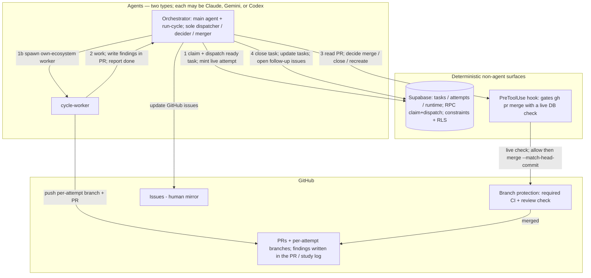

# Task-loop Supabase harness — diagrams (operator-finalized)

Companion to `2026-06-15-task-loop-supabase-harness-redesign-conclusion.md`.
Two agent types (orchestrator via `run-cycle`, cycle-worker) + deterministic non-agent surfaces.
**Monotone task lifecycle (open → working → closed) + findings written in the PR (no entity) + a flat attempt ledger.**

## 1. Actors & control flow (orchestrator loop: dispatch → read PR → close)

## 2. Task lifecycle — monotone, three states

```mermaid
stateDiagram-v2
    [*] --> open: created
    open --> working: claim + dispatch (deps satisfied); mints a live attempt
    working --> closed: orchestrator reads the PR and closes
    closed --> [*]
    note right of working
      working ALWAYS leads to closed.
      "interrupted / stuck" is handled at the ATTEMPT level
      (dead live attempt -> abandoned + a new live attempt), NOT a task back-edge.
    end note
    note left of closed
      success -> PR merged
      failed/invalid -> closed, not merged
      blocked -> closed AND a NEW task created with the blocking dependency
        (the original always closes -> everything unified under working->closed)
    end note
    note left of open
      claimable = open AND all deps satisfied
      blocked (derived) = open AND an unmet dependency
    end note
```

## 3. Attempt — a flat ledger (fencing + artifact accounting + recovery)

```mermaid
stateDiagram-v2
    [*] --> live: dispatch inserts a live attempt
    live --> merged: its PR merged (hook-gated)
    live --> abandoned: superseded / interrupted / stuck; artifacts cleaned
    merged --> [*]
    abandoned --> [*]
    note right of abandoned
      "interrupted / stuck" recovery lives HERE: a stale-lease live attempt
      is abandoned and a new live attempt is minted; the task stays working.
      superseded = abandoned + superseded_by_attempt_id.
      branch/PR tagged Task-Loop-Task + Attempt; reconciled vs GitHub by marker.
    end note
```

Columns: `{attempt_id, task_id, owner, lease_expires_at, branch, pr, head_sha, disposition, superseded_by_attempt_id, artifacts_cleaned_at}`. Worker writes fenced on `attempt_id == the task's live attempt`; per-attempt branch.

## 4. Findings — written in the PR, NOT a database entity

The worker writes its findings (with rubric + results) **in the PR / study log** and reports "done" — there is **no finding table and nothing structured returned**. The orchestrator **reads the PR** and decides the follow-up:

- `success` → merge the PR, close the task, unblock dependents, discover/add new tasks + open issues.
- `failed/invalid` → close the task (PR not merged / kept as the log), adjust list + issues.
- `blocked` → close the task **and create a new task** with the blocking dependency (create the blocker first if needed), redirecting dependents to it.

**Accepted trade:** cross-task invalidation (task A's PR reveals task B is invalid) is handled by **orchestrator judgment when reading the PR + the PreToolUse merge hook** — not a machine-enforced DB guard. Simpler, at the cost of "structurally impossible" for that one case.

## Loop order, recovery & quiescence

- **Loop order each turn:** (1) process completed PRs (close tasks, apply follow-ups, replan) → (2) claim/dispatch → (3) merge.
- **Recovery:** interrupted/stuck is attempt-level (dead live attempt → abandoned + new live attempt; reconciled vs GitHub by the `Attempt` marker — adopt the pushed branch/PR or abandon).
- **Quiescence** = no open/working tasks ∧ no `live` attempts ∧ every `abandoned` attempt has `artifacts_cleaned_at` ∧ a GitHub marker scan finds no orphan task-loop PR/branch.
