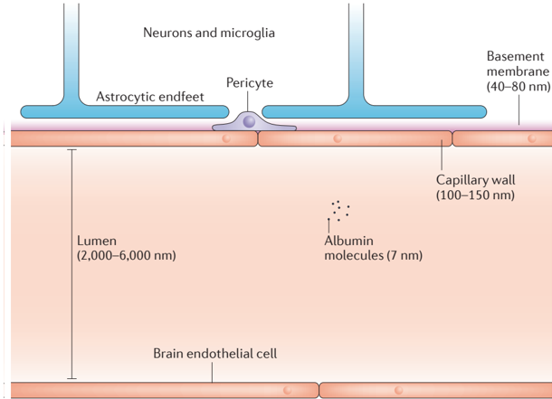
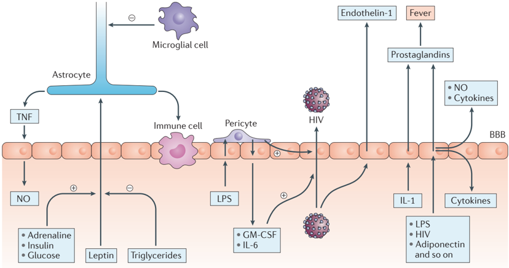
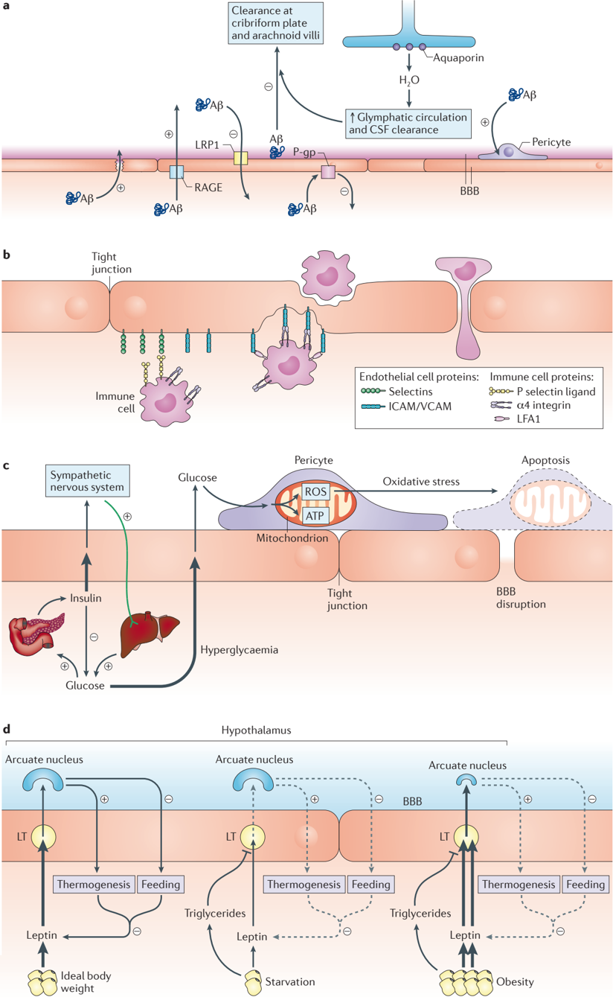
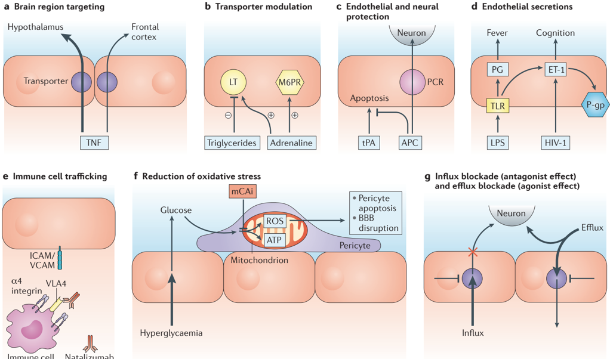

## Blood-brain barrier

(BBB). The modified capillary bed of the brain; can be conceptualized as those processes that, taken together, control the exchange of substances between the blood and the fluids (cerebrospinal fluid and brain interstitial fluid) of the central nervous system (CNS).

Veterans Affairs Puget Sound Health Care System, Geriatrics Research Education and Clinical Center and Department of Medicine, University of Washington School of Medicine, Division of Gerontology and Geriatric Medicine, 1660 South Columbian Way, Seattle, Washington 98108, USA. wabanks1@uw.edu

doi:10.1038/nrd.2015.21 Published online 22 Jan 2016

## From blood-brain barrier to bloodbrain interface: new opportunities for CNS drug delivery

William A. Banks

Abstract | One of the biggest challenges in the development of therapeutics for central nervous system (CNS) disorders is achieving sufficient blood-brain barrier (BBB) penetration. Research in the past few decades has revealed that the BBB is not only a substantial barrier for drug delivery to the CNS but also a complex, dynamic interface that adapts to the needs of the CNS, responds to physiological changes, and is affected by and can even promote disease. This complexity confounds simple strategies for drug delivery to the CNS, but provides a wealth of opportunities and approaches for drug development. Here, I review some of the most important areas that have recently redefined the BBB and discuss how they can be applied to the development of CNS therapeutics.

Developing therapeutics for brain diseases is a major challenge, and a particularly formidable aspect of that challenge is the blood-brain barrier (BBB). Named early in the twentieth century for its ability to prevent the uncontrolled leakage of substances from the blood into the brain, the BBB has emerged as a complex, dynamic, adaptable interface that controls the exchange of substances between the central nervous system (CNS) and the blood (BOX 1) . The cells that make up the structure of the BBB (FIG. 1) communicate with the other cells of the CNS, adapting their behaviour to serve the needs of the CNS, responding to pathological conditions, and in some cases participating in the onset, maintenance or progression of disease. On the one hand, this complexity in barrier function explains much of the difficulty in developing drugs that can cross the BBB, but on the other hand it offers unique and diverse opportunities for drug development.

Here, I review the work in five areas from the past 30 years that has the potential to transform approaches to CNS drug delivery, first considering new work and some of the novel approaches it presents, and then considering how this work modifies classical approaches. Although there have been advances in BBB research in other areas, those selected for discussion in this Review are considered to have most relevance to drug development. I then consider specific diseases in which the BBB itself is an active player and how the BBB can be targeted therapeutically. Finally, I discuss future directions for CNS drug delivery that combine new and classical approaches.

## From 'barrier' to 'interface'

The past 30 years have seen a great deal of research on the BBB and the fields related to it. This work has expanded our understanding of how the BBB functions, how it interacts with its environment, how it can be affected by disease, and how it can predispose to or even cause disease. Some of the work has come from an expansion of traditional areas of BBB research, but much more comes from integration with fields that, 30 years ago, would have been thought to have little or no connection with the BBB. This work can be categorized into the following five areas: the neurovascular unit (NVU), transporters , barrier cell secretions, polarization , and adaptations and modifications of BBB functions. As discussed below, these advances suggest new strategies for CNS drug delivery and ways to improve on traditional CNS drug delivery approaches, and also demonstrate several diseases in which the BBB itself should be the therapeutic target.

The neurovascular unit. The anatomical locations of barrier functions in the CNS are complex. The vascular BBB, the spinal cord barrier and the barriers of the cranial nerves are formed by endothelial cells, and the blood-cerebrospinal fluid (CSF) barrier at the choroid plexus by modified epithelial (ependymal) cells 1 . Circumventricular organs - small regions of the brain with vasculature that does not form a tight BBB - are separated from the rest of the brain by a barrier formed by tanycytes and from the adjacent CSF by ependymal cells. The blood-retinal barrier consists of an inner

## Box 1 | The first 100 years of BBB research

Experimental evidence for a barrier to the movement of solutes from blood into the tissue bed of the central nervous system (CNS) dates back to the 1880s. The most widely known experiments are those of Paul Ehrlich, who demonstrated that many dyes did not stain the CNS after their peripheral injection. The dyes bound tightly to albumin, leaving almost no unbound dye available for passage into the CNS. These studies, therefore, demonstrated the impermeability of the blood-brain barrier (BBB) to large circulating proteins. By contrast, studies from the 1920s to 1940s showed that cerebrospinal fluid (CSF) levels of glucose and inorganic compounds, including electrolytes, mirrored the levels found in blood 169,170 . These CSF/serum ratios differed among substances and were altered in disease. Thus, the barrier phenomenon was not absolute, but somehow differentiated among substances and responded to pathophysiological conditions.

By the late 1950s, one basis of differentiation among substances was well established: the BBB often behaved like a lipid membrane 171 . Small, lipid-soluble substances could readily enter the CNS, whereas more water-soluble drugs, those that were highly charged, or those that bound tightly to serum proteins could not. However, many researchers doubted whether a physical barrier existed or could otherwise explain the many complex phenomena attributed to the barrier 172 , until the late 1960s. Then, ultrastructural studies showed that the capillary bed of the brain possessed tight junctions between brain endothelial cells (BECs) as well as a virtual absence of macropinocytotic vesicles and intracellular fenestrae 173 . Tight junctions were also found at the choroid plexus, thus explaining the presence of the blood-CSF barrier. These studies showed that at least two parallel barriers existed: a blood-CSF barrier located at the choroid plexus, and a vascular BBB located at the arteriole-capillary-venule level.

Transporters provided another mechanism by which the barrier could differentiate among substances, explaining how glucose, electrolytes, vitamins and some peptides and regulatory proteins can cross the barrier at rates that are 10-100 times faster than those predicted by the lipid membrane model.

In summary, the first 100 years of study of the BBB (1880s-1980s), established some central, somewhat paradoxical features of the BBB. The next 30 years would see barrier research explode, adding many new aspects to the understanding of the barrier phenomenon.

## Neurovascular unit

(NVU). For the purposes of this Review, this refers to the concept that the cells forming the BBB are in communication with other cells of the central nervous system (CNS) and, by extension, with the circulating immune cells, and with the peripheral tissues via blood-borne secretions.

## Transporters

Proteins that provide a mechanism by which substances can be carried from one side of the blood-brain barrier (BBB) to the other, thus greatly increasing (for blood-to-brain transporters) or greatly decreasing (for brain-to-blood transporters) the central nervous system (CNS) uptake of a substance in comparison with that predicted based on its physicochemical characteristics.

barrier of endothelial cells and an outer barrier involving the retinal pigment epithelium. Many of these barriers have been poorly studied, but it is clear that each of the barriers is adapted to the special needs of the tissues it serves, responds to disease states, has intercellular tight junctions as a central feature to its barrier function, and directly interacts with the cells in its microenvironment.

The vascular BBB is the best studied regarding this last phenomenon of intercellular interactions: the brain endothelial cells (BECs) and the cells with which they interact are collectively referred to as the NVU (FIG. 2) . The concept of the NVU emphasizes that BECs are in intimate and constant crosstalk with astrocytes, microglia, neurons, mast cells and pericytes, as well as circulating immune cells 2 . This communication helps refine the functions of the BBB to serve the needs of the brain and facilitates brain-body communication. The astrocytes and pericytes in particular are responsible for enabling the capillary bed to adopt and maintain barrier characteristics 3,4 .

Neuroimmune modulators are clearly involved in NVU-BBB crosstalk 5 . Release of cytokines and other immunoactive substances from astrocytes, microglia, leukocytes and even the BECs themselves modify a host of BBB functions, altering BBB integrity, BBB transporters, and the permeability of the BBB to pathogens and circulating immune cells. Increasingly elaborate examples of NVU communications are being elucidated.

For example, in mouse models of Alzheimer disease, astrocyte-derived apolipoprotein E (APOE) modulates a peptidyl-prolyl cis-trans isomerase A (PPIase A; also known as cyclophilin A)-matrix metalloproteinase (MMP) pathway in pericytes, activation of which results in BBB disruption 6 . As discussed below, this and other NVU interactions offer unique therapeutic targets in Alzheimer disease, diabetes and other conditions.

Transporters. Although transporters are a classical characteristic of the BBB, so much has been learned about them during the past 30 years as to redefine them for the purposes of CNS drug delivery. The presence of BBB transporters explains how water-soluble molecules such as glucose and amino acids that are needed in abundance by the CNS can cross the BBB at rates that are 10-100 times faster than would be predicted from their physicochemical characteristics 7 . Transporters also mediate the CNS uptake of large molecules such as regulatory proteins, which cannot cross the BBB by transendothelial diffusion 8 . The presence of CNS-to-blood transport (efflux) systems explains why many substances enter or accumulate in the CNS at rates lower than would be predicted based on their physicochemical characteristics. Active transport refers to an energy-requiring system and can transport a substance against its concentration gradient, whereas facilitated diffusion does not require energy and transports its ligands down a concentration gradient, from higher to lower concentrations.

Blood-to-brain transporters. Transporters exist for a surprising array of molecules, including cytokines 9 and oligonucleotide analogues 10 . Phosphorothioate oligonucleotides are rapidly sequestered by and transported across the BBB. The transporter seems promiscuous towards phosphorothioate oligonucleotides, as it has been shown to transport into the brain every phosphorothioate oligonucleotide tested so far. The transporter, when combined with the highly favourable pharmacokinetics of phosphorothioate oligonucleotides, enables the delivery of these molecules to the brain in therapeutically effective amounts. These molecules have shown therapeutic benefits in animal models of multiple sclerosis 11 , Alzheimer disease 10,12,13 and  stroke 14 .  For  example, peripheral administration of an antisense oligo  nucleotide directed against amyloid precursor protein decreased levels of amyloid-β 40 (Aβ 40 ), Aβ 42 and amyloid precursor protein in the brain, improved cognitive deficits, decreased oxidative stress, restored deficits in the brain-to-blood efflux of Aβ and in bulk flow, normalized brain levels of lowdensity lipoprotein receptor-related protein 1 (LRP1), and reduced neuroinflammatory markers in animal models of Alzheimer disease 12,15,16 .

The existence of saturable transporters and their unique characteristics offer substantial untapped potential for drug development. The endogenous ligands of transporters are seldom useful as therapeutics because of their unfavourable pharmacokinetic properties. Brainderived neurotrophic factor, for example, crosses the BBB rapidly 17,18 , but its short half-life in blood limits its CNS effects. One strategy is to develop drug analogues of

Figure 1 | Proportions of the blood-brain barrier. Schematic with dimensions of the vascular blood-brain barrier (BBB), including the capillary lumen and walls, and the basement membrane, relatively scaled. Note the albumin molecules with a diameter of 7 nm. Other components of the neurovascular unit are indicated, but not scaled. Nature Reviews | Drug Discovery

## Polarization

A characteristic of the blood-brain barrier (BBB), arising from different characteristics of its abluminal and luminal surfaces, including differing levels of enzymes, glycoproteins, lipid composition and transporters.

## Active transport

Transport by an energyrequiring transporter that can move its ligand against a concentration gradient.

## Facilitated diffusion

Transport by a non-energyrequiring transporter that moves it ligand down a concentration gradient.

## Adsorptive transcytosis

A mechanism by which glycoproteins or highly chargedmolecules bind to brain endothelial cell (BEC) glycoproteins, inducing vesicles that are routed to the opposite membrane.

endogenous ligands that can use the BBB transporters to enter the CNS. However, this does not seem to have been a widely exploited strategy, and few CNS drugs are known to use transporters to cross the BBB. Examples include: l-dopa, melphalan, baclofen, thyroid hormones and gabapentin, which use transporters for neutral amino acids; valproic acid, which probably uses a monocarboxylate transporter; and acetylcholinesterase inhibitors, vera  pamil, levofloxacin and cephaloridine, which use an organic cation-carnitine transporter. A major challenge is to develop analogues that are resistant to the enzymatic and clearance mechanisms of the ligand but are still able to bind with high affinity to the ligand's BBB transporter and CNS receptors.

A therapeutic antagonist effect can be induced by blocking a substance from accessing its BBB transporter, thus preventing it from reaching the CNS. Classic examples are the manipulation of amino acid uptake into the brain by the large neutral amino acid (LNAA) transporter. LNAAs have many roles in the brain, including acting as precursors for monoamines and neurotoxic substances. By inhibiting the uptake of one LNAA with another LNAA or a subclass of LNAAs, one can affect brain function and disease responses 19 . An example is maple syrup urine disease, a condition in which an excess of branched chain amino acids (BCAAs) are taken up into the brain by the LNAA transporter, resulting in neurotoxic effects. Raising blood levels of other LNAAs competitively inhibits the transport of BCAAs into the brain by the LNAA transporter, thus lowering brain levels of BCAAs and reducing neurotoxicity. A similar strategy has been suggested for phenylketonuria, a condition in which an excess of the LNAA phenyla  lanine produces neurotoxicity. Blockade of the LNAA transporter with BCAAs has been attempted to reduce brain levels of tyrosine in individuals with bipolar disorder, to reduce brain phenylalanine levels in tardive dyskinesia, and to lower brain levels of glutamate in amyotrophic lateral sclerosis 19 . Another example is the use of a pegylated leptin analogue that does not cross the BBB but binds to the BBB leptin transporter, thus blocking the blood-to-brain transport of endogenous leptin 20 . This results in increased feeding, which suggests that this analogue could be useful in the treatment of anorexia.

Approaches using the ligands of transporters to deliver therapeutic cargoes have been under development for 30 years, and have been previously reviewed 21 . In this case, the ligand is not the therapeutic, but is used as a vehicle to deliver an attached therapeutic. Although increased BBB permeation is the main objective of this approach, it is likely that the pharmacokinetics of the drug, especially its half-life, are also improved 22 . One version of this approach that has gained much interest is to develop an antibody targeted to a region of the transporter protein that is not directly involved in binding to the endogenous ligand. In this way, it is hoped that the delivery system will not interfere with the transport of the endogenous ligand into the CNS.

Some pathogens gain access to the CNS using a similar strategy of binding to a transporter or receptor at a non-ligand-binding site. For example, the West Nile virus targets Toll-like receptor 3 (TLR3) 23 , whereas herpes varicella zoster virus and cell-free HIV-1 target the mannose-6-phosphate receptor (M6PR) 24,25 . This observation has prompted the idea that the strategies used by pathogens to cross the BBB might be adaptable to drug delivery 26 . The cellular machinery involved in the internalization of antibodies and pathogens that have bound to a site not used by the endogenous ligand is likely to be related to mechanisms underlying adsorptive endocytosis and adsorptive transcytosis (AE/AT) rather than to the transporter. A low-affinity binding antibody specific for the BEC transferrin receptor has recently been used to target Aβ production in an animal model of Alzheimer disease 27,28 . Recent evidence suggests that immunoglobulin G (IgG) antibodies that have only one antigen-binding arm rather than the typical two may be internalized using a transporter rather than via adsorptive endocytic machinery 29 .

A drug crossing the BBB by transendothelial diffusion will enter all regions of the brain to a similar degree, thus producing off-target effects in the case of pluripotent drugs. The heterogeneous distribution of many of the transporters for biologics offers a strategy to selectively deliver a drug to a targeted region of the brain. Tumour necrosis factor (TNF), for example, is primarily transported into the hypothalamus and occipital cortex 30 , whereas the interleukin-1 (IL-1) transporter is highly concentrated at the posterior division of the septum 31 . By using a transporter that targets a specific brain region and thus the function of this region, such as a transporter with enriched expression in the hypothalamus for a feeding effect or a hippocampal transporter for a memory effect, the specificity of a drug can be increased and its side effects decreased.

Figure 2 | The neurovascular unit and brain endothelial cell secretions. The ability of brain endothelial cells (BECs) to receive, transfer and transmit signals makes the blood-brain barrier (BBB) an information conduit between the central nervous system (CNS) and periphery. As shown on the left, leptin transport across the BBB is modulated by blood levels of adrenaline, insulin, glucose and triglycerides. Astrocyte control of immune cell trafficking is influenced by leptin and microglia, and astrocytes affect nitric oxide (NO) release from BECs by secreting tumour necrosis factor (TNF). The middle region of the figure shows that lipopolysaccharide (LPS) enhances HIV transport across the BBB - a process that is intensified by pericytes - by inducing the release of granulocyte-macrophage colony-stimulating factor (GM-CSF) and interleukin-6 (IL-6) from BECs; GM-CSF and IL-6 act at the luminal surface of the BEC in an autocrine fashion. HIV induces the release of endothelin-1 from BECs; cerebrospinal fluid (CSF) levels of endothelin-1 correlate with AIDS-related cognitive impairment. The region on the right shows that cytokines, gastrointestinal hormones, viruses and LPS induce the release of substances from BECs that can enter the brain or blood; for example, IL-1 induces the release of prostaglandins from BECs, thus inducing fever. Nature Reviews | Drug Discovery

Brain-to-blood transporters. Efflux transporters can dramatically decrease brain uptake or retention of their substrates just as influx transporters can dramatically increase uptake and retention. Efflux transporters have been discovered for nearly every substance class, including ions, amino acids, peptides and cytokines. Many BBB transporters, including the glucose transporter GLUT1, are facilitated diffusion systems and therefore bidirectional by nature, moving substances down a concentration gradient from a region of higher to lower concentration. Defective efflux transporters can contribute  to  disease,  as  illustrated  by  the  decreased brain-to-blood transport of Aβ peptide. Such efflux ordinarily helps to control brain levels of Aβ, and loss of efflux contributes to an increasing amyloid burden in the brain. Efflux transporters can also prevent exogenous substances such as plant alkaloids from entering the CNS. Morphine, for example, is a weak substrate for P-glycoprotein (P-gp). P-gp has a broad range of ligands and is a major cause of the inability of many potential therapeutics to enter the brain 32 .

Inhibition of efflux transporters is exemplified by the inhibition of P-gp in the treatment of seizures with verapamil 33 . However, given that so many endogenous and exogenous compounds are ligands for this transporter, long-term inhibition of P-gp would probably result in neurotoxicity and may not, therefore, be feasible.

Inhibition of more targeted efflux systems, however, can improve therapeutic effects. For example, following inhibition of the efflux transporter for pituitary adenylate cyclase-activating polypeptide 27 (PACAP27), a neuroprotective peptide, using an oligophosphorothioate capable of being taken up by the BBB, brain retention of peripherally administered PACAP27 increased by about fourfold and therapeutic outcomes improved in models of stroke and Alzheimer disease 14 .

Barrier cell secretions. The discussion above on the NVU emphasizes that secretions from astrocytes, microglia, neurons, pericytes and circulating immune cells have the ability to influence the behaviour of the BBB. However, the BECs and ependymal cells that form the BBB also secrete substances, making communication between the BBB and the other cells of the NVU bidirectional. The characteristics of secretion by barrier cells are similar to those of many other cells in that some secretions are constitutive and others are induced. Many of these secreted substances relate to inflammation, such as prostaglandins, nitric oxide and cytokines 34-36 .

Some effects of these secretions are mediated in an autocrine fashion; that is, the BEC modifies its own behaviour through its secretions 37 . For example, activation of the innate immune system induces the release of granulocyte-macrophage colony-stimulating factor

(GM-CSF) and IL-6 from BECs, which then act on the luminal surface of the BECs to enhance the transport of cell-free HIV-1 across the BBB 37 . This suggests that bloodborne antagonists of GM-CSF and IL-6 could retard HIV-1 entry into the brain and thereby help to reduce the neurological complications associated with HIV/AIDS. Other effects of barrier secretions are mediated indirectly, and are dependent on crosstalk with the other members of the NVU 38,39 .

Polarization. The cells that form the BBB are polarized in that they have an abluminal surface that faces towards the CNS and a luminal surface that faces towards the blood. Like all cell membranes, those of the barrier cells are lipid bilayers with an inner leaflet in contact with the cytoplasm and an outer leaflet in contact with the interstitial fluid. The ubiquitous tight junctions between cells act like fences, impeding the exchange of lipids and proteins between the luminal and the abluminal outer leaflets 40,41 . Thus, the lipids and proteins that constitute the leaflets and, by extension, the functions of those leaflets differ between the luminal side and the abluminal side of the BBB.

This polarization increases the complexity of the BBB and its utility to the CNS. The most obvious example is that of transporters: with an ability to restrict transporters to the luminal or abluminal side, unidirectional blood-to-brain or brain-to-blood transport is possible.

Secretions can also be polarized. For example, one in vitro study found that BECs secreted IL-6, GM-CSF and TNF from both the luminal and abluminal membranes, but secretions from the luminal membrane were much greater than those from the abluminal membrane 42 . Polarized secretion can also support a form of communication across the BBB, linking the CNS and peripheral tissues via the BBB 42 . Thus, an immune activator on one side of the BBB can induce the release of an immune substance from the other side, thereby forming a unique axis of communication between the peripheral and CNS immune systems. This provides a theoretical therapeutic approach in that a stimulus acting at the luminal side of the BBB could induce it to secrete a desired substance from its abluminal side or, by contrast, a luminal substance could act to block a constitutive abluminal secretion. As an example, peripheral administration of lipopolysaccharide (LPS) induces a biphasic fever by inducing BECs to release prostaglandin E2 (REF. 43) . As LPS does not cross the BBB 44 , this means that it is acting on the luminal surface of the BBB to induce the release of prostaglandin E2 from the abluminal surface. As another example, indomethacin, which poorly penetrates the BBB because of protein binding 45 , probably blocks the early phase of fever by acting on the luminal side of the BBB, thus decreasing secretion of prostaglandin E2 from the abluminal side 46 .

Adaptations and modifications of BBB functions. The functions of the BBB are not static; rather, they adapt to the needs of the CNS throughout life and in response to disease. Both blood-to-brain and brain-to-blood transporters can rapidly adapt to physiological changes or be affected by (and contribute to) disease states. Transporters seem to change much earlier, more rapidly, and in response to a larger number of conditions than do other features of the BBB, such as barrier integrity or transendothelial diffusion. Some of the most dramatic examples of BBB adaptation to the needs of the CNS occur during brain development and maturation 47 . Such adaptations in transport activity are physiologically necessary so that the BBB can respond to the changing needs of the CNS. Altered transport can also be the result of disease, a cause of disease, or a sustaining element of disease.

BBB adaptations can be key elements in an organism's responses to physiological challenges. The rate at which the anorectic leptin is transported across the BBB 48 , for example, is greatly reduced during starvation, while transport of the orexigenic peptide ghrelin is increased 49 . By increasing the signals that promote feeding and decreasing those that suppress feeding, the BBB is acting to encourage changes in behaviour that are appropriate to starvation. Furthermore, the effects on the ghrelin and leptin transporters are mediated in part by serum triglycerides. Triglyceride levels are increased in blood as they are mobilized from fat as the main energy source in starvation. By inducing changes in the BBB transport rate of feeding hormones, hypertriglyceridemia is signalling the state of starvation to the brain.

BBB alterations are also seen after insults to the CNS. Spinal cord injuries alter the transport rates of molecules with neuroinflammatory and neurotrophic properties, such as TNF, PACAP and leukaemia inhibitory factor 50 , whereas stroke upregulates transport of TNF 51 and PACAP 52 . Inflammation increases the rate at which immune cells and pathogens such as HIV-1 can cross the BBB, and it can modulate many transport systems, including P-gp 53 .

Some of these adaptations by the BBB are mediated by molecular signals coming from the CNS or peripheral tissues via the blood. Many molecules have been identified that can modulate transporter function and therefore could be the agents by which physiological states and diseases alter transporters. The effects of triglycerides released from adipose tissue on the transport of feeding hormones have been discussed above. Other examples include the ability of arginine vasopressin, insulin and amylin to alter the transport of amino acids across the BBB, and the ability of endothelin-1 to decrease - and of TNF to increase - P-gp activity at the BBB.

Four mechanisms have been elucidated by which molecules can alter BBB transporters. The first mechanism involves the molecule acting as an allosteric regulator of the transporter, as exemplified by the actions of aluminium and leucine on the BBB efflux transporter peptide transport system 1 (PTS-1). The second mechanism involves the activation of cellular mechanisms that alter the expression of the transporter, as exemplified by LPS, endothelin-1 and TNF altering P-gp function through nuclear factor-κB (NF-κB) 54,55 . The third mechanism involves stimulating the release of another substance, as exemplified by LPS enhancing HIV-1

## Passive diffusion

The mechanism by which a substance crosses the blood-brain barrier (BBB) by non-saturable means, with the degree of passage depending on the physicochemical characteristics of the substance.

## Extracellular pathways

Areas such as the pial surface and subarachnoid space that are deficient in a blood-brain barrier (BBB) and thus allow small amounts of blood-borne substances, including albumin and immunoglobulins, to access the brain primarily through the Virchow-Robin spaces.

transport through the release of IL-6 and GM-CSF 37 . The fourth mechanism is competitive inhibition, and is exemplified by verapamil increasing brain uptake of peptides, colchicine, and vinblastine; in this case, verapamil competes with these substances for brain-to-blood efflux by P-gp 56,57 .

The adaptive mechanisms and their manipulation provide opportunities for drug development. Examples of therapeutic manipulation of transporters include increasing the delivery of leptin and lysosomal enzymes to the brain with adrenergic receptor modulators. Defective transport of leptin across the BBB is an early form of leptin resistance in obesity. α-adrenergic receptor modulators can increase the rate of leptin transport by two- to threefold, and this may be one mechanism by which drugs with activity at α-adrenergic receptors are associated with weight loss 58 . The CNS manifestations of lysosomal storage diseases respond to enzyme replacement therapy during the neonatal period 59 because M6PR is active, but not during adulthood when M6PR activity at the BBB is abated. Treatment with adrenaline restores M6PR activity levels to those of the neonate and offers a strategy for treating these diseases in adults 60 . Drugs that block P-gp (such as verapamil) 33 or alter its expression 61 have been proposed as therapeutic approaches; the use of anti-seizure drugs that are not P-gp ligands 62 , such as valproic acid, might also provide a therapeutic strategy. Manipulation of serum triglyceride levels could shift the BBB transport of feeding hormones away from the starvation pattern; one study found that gemfibrozil, a drug that selectively lowers triglycerides, induces weight loss 63 . Efflux transporters can also be manipulated, allowing increased entry of drugs that would otherwise be excluded. For example, the activities of P-gp and LRP1 can be modulated by endothelin 1, TNF, vitamin D and drugs that increase nitric oxide levels 64 .

The ability to adapt provides a mechanism by which the BBB can fine-tune its service to the CNS. However, adaptive mechanisms can also be misdirected, leading to or supporting disease states. For example, triglycerides are elevated in starvation, but they are also elevated in obesity. Whereas triglycerides have an adaptive effect on the transport of feeding hormones in starvation, they have a maladaptive effect in obesity and may underpin the inability of peripherally administered hormones to effectively treat obesity 65 . Seizures can increase P-gp activity and, because almost every anti-seizure drug is a weak P-gp ligand, they can reduce the ability of these drugs to reach the brain 66 . Increased P-gp activity may explain why patients with status epilepticus and LennoxGastaut syndrome are refractory to anti-seizure medications 66,67 . Alterations in transporter activities caused by diseases complicate drug delivery and development, suggesting that, when possible, drug development is best carried out using animal models of the disease of interest.

## Classical CNS drug delivery revisited

The work reviewed above is influencing the more established approaches to drug development. The best understood mechanisms by which substances cross the

BBB are passive diffusion (also known as transendothelial diffusion) and the saturable processes of facilitated diffusion and active transport. Extracellular pathways and adsorptive transcytosis, mechanisms of entry that were not originally well differentiated from BBB disruption, are increasingly being investigated. Although many factors determine the degree to which a substance crosses the BBB, these factors largely fall into nine categories 68 , as outlined below. Interactions among these nine mechanisms, especially in light of the new information reviewed above, make the development of CNS drugs complicated, but also offer interesting and unexpected opportunities (TABLE 1) .

Passive diffusion. Passive diffusion is the non-saturable mechanism by which most small molecules in the pharma  copoeia enter the brain. Unlike uptake by most cells, which requires penetration of only the cell membrane, passage across the BBB requires that the entire cell be traversed. The degree to which a substance can undergo such transendothelial diffusion is largely dictated by its pharmacokinetic characteristics. The most important of these physicochemical characteristics are lipid solubility, hydrogen bonding and molecular mass 69,70 . For a substance to reach its site of action in the CNS, it must partition from the lipid environment of the cell membranes that form the BBB back into the aqueous environment of brain interstitial fluid and/or CSF. Drugs that are extremely lipid soluble become sequestered in the peripheral and barrier cell membranes, reducing their ability to access brain interstitial fluid. As measured by the octanol/water partition coefficient, the ideal ratio for brain extraction is between 10:1 and 100:1. Charge influences partitioning between aqueous and lipid environments; because CSF tends to be slightly more acidic than plasma, uptake of weak bases is slightly favoured and weak acids are somewhat more excluded from CSF 71 . Charge also influences some of the other eight categories that determine the extent to which a drug can cross the BBB, especially those related to transporters, protein binding, and adsorptive transcytosis.

The relationships between BBB permeability and physicochemical characteristics can be predicted with greatest accuracy for small molecules, but similar - albeit modified - rules exist at least for small biologics, such as peptides 72,73 . For example, BBB permeability will be influenced by secondary structure - for instance, folding to 'hide' charges, thereby making the peptide more lipophilic than the primary structure would predict 74 . Cyclization greatly increases the lipid solubility of peptides, but often makes them substrates for brain-to-blood efflux systems so that net uptake by the brain is often decreased 75 . Halogenation, the addition of lipid peptide or non-peptide co-drugs and signal peptides, and substitution of amino acids with less charged amino acids have all been shown to increase the BBB penetration of peptides. Despite the powerful influences of physicochemical characteristics on BBB penetration, the influence of the other eight categories limits the exclusive use of theoretical or in silico models in predicting drug action.

Cerebral blood flow. Substances can be broadly categorized as those that are flow dependent and those that are flow independent. Flow dependence occurs when a substance is extracted from the circulation so rapidly (either because of transendothelial diffusion or because of robust saturable transport) that the concentration at the venous end of the capillary is significantly lower than at the arterial end. For these substances, increasing blood flow increases the amount of drug presented to the BBB and thereby the amount of drug entering the brain. Glucose is flow dependent and so a brain region has to meet increased metabolic demands by increasing blood flow. Flow dependence is a theoretical disadvantage for drug delivery as blood flow, and thus the amount of drug delivered to a brain region, will depend on the metabolic activity of the brain region rather than on its therapeutic need. By contrast, the delivery rate of a flow-independent drug is the same regardless of the metabolic state of viable brain tissue. Such mismatches between therapeutic levels and blood flow would be particularly acute after ischaemic events and may underlie some of the toxicity associated with tissue-type plasminogen activator (tPA) in the treatment of stroke, as discussed below.

Degradation. The peripheral tissues, blood, CNS and the cells comprising the BBB can all be significant sources of drug degradation. Degradation by peripheral tissues and blood affect the pharmacokinetics of clearance before the drug can penetrate the BBB, and degradation within the CNS limits residence time at the site of action. Degradation at the barrier tissues can create an enzymatic barrier that can be a substantial reason for a substance not being taken up by the CNS, as exemplified by the monoamines and encephalins 76,77 . The BBB acts as an enzymatic barrier to the monoamines adrenaline, noradrenaline and dopamine, in both the blood-to-brain and brain-to-blood directions, using the enzymes monoamine oxidase and catecholO -methyltransferase 77 . Drug penetration of the BBB and neurotoxicity can be influenced by these enzymes as illustrated  by  the  1-methyl-4-phenyl1,2,3,6-tetrahydropyridines: the species differences in the ability of this drug to cause Parkinson disease seems to be caused by differences in the expression of monoamine oxidase 78 . In perhaps the earliest example of the existence of the NVU, these enzymes are induced at the BBB by the adjacent neural tissues 79 . In a similar fashion, the enzyme 4-aminobutyrate aminotransferase creates a barrier to GABA (γ-aminobutyric acid) permeation 80 . In the case of encephalins, inhibition of enzymes or the use of enzymatically resistant analogues indicates that uptake is reduced to about one-quarter by the enzymatic barrier 76 .

Pharmacokinetics of the substance. A substance cannot cross the BBB unless it can be presented to the BBB, and that presentation is largely dictated by the pharmacokinetic characteristics of the substance. Regardless of their peripheral route of administration (intradermal, intraperitoneal, intramuscular or intravenous), most drugs must enter the blood before they can enter the brain (other routes, such as retrograde nerve transmission, account for little of the uptake of most therapeutics). A substance with a large volume of distribution or a short half-life in blood will have a lower concentration and less residence time in blood, thus decreasing its presentation to the luminal surface of the vascular BBB, than a substance with the opposite characteristics. Many biologics, including peptides and regulatory proteins, have very short half-lives, creating a pharmacokinetic 'barrier' to CNS penetration. Extending the half-life of a substance, for example, can proportionately increase BBB penetration by increasing its residence time in blood and thus prolonging its presentation to the BBB 81,82 .

Binding in blood. As a general rule, only unbound or free material is available for crossing the BBB via transendothelial diffusion. Transporters are able to access bound materials if the affinity of the substance for the transporter greatly exceeds that of the binder. Many substances are weakly bound to proteins such as albumin, and this fraction of the substance is usually available to transporters, but not for passive diffusion. Thus, the 'biologically available' fraction includes both unbound material and material that is 'weakly' bound, with 'weakly' defined relative to the affinity of the transporter. Plasma and serum proteins constitute the traditional binders in blood, but some evidence shows that cells can also act as binders 83,84 .

Protein binding, however, can have the paradoxical effect of increasing BBB penetration. This can occur because protein binding can greatly alter the peripheral pharmacokinetics of a drug, increasing its half-life and reducing its volume of distribution. Thus, as recently illustrated for IL-2 (REF. 85) , protein binding can have a complex effect on brain uptake, slowing the rate of BBB penetration but increasing the time and concentration of drug exposure to the BBB. For compounds with extremely long half-lives, the extracellular pathways can become relevant for drug delivery 86 .

Extracellular pathways. The extracellular pathways, or functional leaks, are a group of anatomically defined areas that enable small amounts of circulating substances to access the CNS. They include the large vessels of the pial surface and subarachnoid space, some of the interfaces of certain circumventricular organs, the sensory ganglia of spinal and cranial nerves, and the nucleus tractus solitarius 87 . They are a route by which substances can reach the Virchow-Robin spaces, and hence participate in the glymphatic pathway, and are thought to be a major contributor to CNS levels of albumin.

The amounts of material entering the brain via the extracellular pathways are small, as exemplified by albumin with its CSF/serum ratio of about 0.005. However, it has been suggested that substances with long circulating half-lives, small volumes of distribution (that is, largely confined to the vascular space) and potent CNS effects can use the extracellular pathways as a thera  peutic route 86 . Antibodies, erythropoietin, and modified lysosomal enzymes are thought to enter the BBB-intact CNS by these routes.

Antibodies with the potential to cross the BBB are increasingly being developed as therapeutics. The mechanisms by which antibodies or antibody analogues cross

## REVIEWS

Table 1 | Strategies for improved delivery of therapeutics to the brain*

| Strategy                                                                                                                                                                           | Rationale                                                                                                                                                                                             | Challenges                                                                                                                                                                                                                                                             | Examples                                                                                                                                                                                                                                                        |
|------------------------------------------------------------------------------------------------------------------------------------------------------------------------------------|-------------------------------------------------------------------------------------------------------------------------------------------------------------------------------------------------------|------------------------------------------------------------------------------------------------------------------------------------------------------------------------------------------------------------------------------------------------------------------------|-----------------------------------------------------------------------------------------------------------------------------------------------------------------------------------------------------------------------------------------------------------------|
| Improveperipheral pharmacokinetics                                                                                                                                                 | Prolonged presentation to BBBincreases opportunity to cross the BBB; very long circulationtimesinbloodcanallowthe use of extracellularpathways                                                        | Complex,difficult to predict in silico                                                                                                                                                                                                                                 | Lysosomalenzymes 82 ; leptin analogues 81 ;G-CSF peglyation 113 ; antibodies 86                                                                                                                                                                                 |
| Improvelipophilicity and/or hydrogenbondingofsmall peptides                                                                                                                        | Passive diffusion and transendothelial diffusion can occur for peptides <500Da                                                                                                                        | Penetrationratesarelow,soneed potent peptide analogues; increases uptake byperipheral tissuesandso neteffectonbrainuptakemaynot beimproved;structuralchangescan reduceaffinityforCNSreceptor; canbecomesubstrateforBBB efflux systems                                  | Modifysecondarystructure to 'hide' charges 74 ; decrease hydrogenbonding 73                                                                                                                                                                                     |
| Usemechanismofadsorptive transcytosis                                                                                                                                              | Glycoprotein-glycoprotein interactions can induce vesicular BBBtransport; can also induce with highly charged small molecules (for example, polylysines) and other molecules (pluronics; fatty acids) | Difficult to predict or control intracellular vesicular trafficking; someglycoproteins and small highly charged molecules can be very toxic                                                                                                                            | Enhanced delivery with pluronics and glycosylation 114 , 117 ; delivery of lysosomal enzymes with charged molecules (takes advantageofthetendencyof adsorptive transcytosis to route to lysosomes) 116 ; adaptation ofmechanismsusedby CNS-invadingpathogens 26 |
| Developnon-flow-dependent drugs                                                                                                                                                    | Drugdelivery isindependentof variations in cerebralbloodflow                                                                                                                                          | Oftenatrade-off of lower uptake bythe brain                                                                                                                                                                                                                            | Mostbiologics are not flowdependent                                                                                                                                                                                                                             |
| Target BBB transporters (influx)                                                                                                                                                   | Target BBB transporters (influx)                                                                                                                                                                      | Target BBB transporters (influx)                                                                                                                                                                                                                                       | Target BBB transporters (influx)                                                                                                                                                                                                                                |
| Developanaloguesofthe endogenousligandsof transporters                                                                                                                             | Transporter already targeted to desired brain region                                                                                                                                                  | Analoguemustremainaligand fora CNSreceptor as well as a BBBtransporter                                                                                                                                                                                                 | APC 162                                                                                                                                                                                                                                                         |
| Develop'Trojan Horse' carrier molecules                                                                                                                                            | Variety of approaches; could result in a universal carrier                                                                                                                                            | Difficult to predict reaction of BECs(can induce adsorptive endocytosis pathways)                                                                                                                                                                                      | Antibody carrier designed using pharmacokinetic principles 27 ,28                                                                                                                                                                                               |
| Induce antagonist or other therapeutic effect byblocking influxofendogenousligand                                                                                                  | Influx blocker not required to cross the BBB;blockerdoesnothavetobindtoor beactiveatCNSreceptor                                                                                                       | LittleisknownaboutBBB transporters or their binding sites, makingrationaldevelopment difficult                                                                                                                                                                         | BlockCNSuptakeoftoxic aminoacidsusingother aminoacids 19 ; block leptin entry into the brain to induce weight gain 20                                                                                                                                           |
| Initiate exploration for unknowntransporters                                                                                                                                       | LiteraturesuggeststhatmostBBB transporters are not yet discovered; manytransporterswerediscovered serendipitously, with the proteins andgenesunknown                                                  | Multi-disciplinary, coordinated effort is required; difficult to develop a universal strategy                                                                                                                                                                          | Serendipitous discovery of manytransporters, including for antisense oligonucleotideswithunknown transporter protein,geneand endogenousligand 10,13                                                                                                             |
| Target BBB transporters (efflux)                                                                                                                                                   | Target BBB transporters (efflux)                                                                                                                                                                      | Target BBB transporters (efflux)                                                                                                                                                                                                                                       | Target BBB transporters (efflux)                                                                                                                                                                                                                                |
| Improve BBB drug penetrationandCNS retention by inhibiting efflux of a drug with competitive inhibitors, small molecules, regulators or BBB-penetrating antisense oligonucleotides | Manypotential drugs are efflux ligands and so they cannot accumulate in the brain                                                                                                                     | Theefflux transporters involved forthedrugmustbeknown;must havethedrugtoinhibit efflux; often morethanoneeffluxsystemis involved in the efflux of adrug; efflux transporters often havemultiple ligands so that inhibition canaffect manydrugsandendogenous substances | InhibitionofPTS-6with BBB-penetrating antisense oligonucleotides improves the therapeutic effects of PACAP27 (REF. 14 ) ;improved retention of anticonvulsants bycompetitively inhibiting their efflux 33                                                       |
| BBB as a therapeutic target                                                                                                                                                        | BBB as a therapeutic target                                                                                                                                                                           | BBB as a therapeutic target                                                                                                                                                                                                                                            | BBB as a therapeutic target                                                                                                                                                                                                                                     |
| Protection fromorreversal of BBBdisruption                                                                                                                                         | Manydiseases involveBBB disruption                                                                                                                                                                    | Disruptionmechanismsarecomplex with fewdefinedtargets                                                                                                                                                                                                                  | APCprotects BECs from tPA-induced apoptosis 162 ; protectionofBBBindiabetes 103                                                                                                                                                                                 |
| Modulationwithsmall molecules and/or allosteric regulators                                                                                                                         | Rate of the transporter can be regulated by small molecules; usually does not require a small molecule to cross BBB; enhancers and inhibitors are available                                           | Structures of mostBBBtransporters andtheir allosteric binding sites areunknown                                                                                                                                                                                         | IncreasedBBBpenetration of anorectic leptin with α -adrenergic receptor agonist 58 ; induction of transport of lysosomalenzymesacross theBBBwithan α -adrenergic receptor agonist 60                                                                            |

Table 1 (cont.) | Strategies for improved delivery of therapeutics to the brain*

| Strategy                                                             | Rationale                                                                                                                      | Challenges                                                                                                                | Examples                                                                      |
|----------------------------------------------------------------------|--------------------------------------------------------------------------------------------------------------------------------|---------------------------------------------------------------------------------------------------------------------------|-------------------------------------------------------------------------------|
| BBB as a therapeutic target (cont.)                                  | BBB as a therapeutic target (cont.)                                                                                            | BBB as a therapeutic target (cont.)                                                                                       | BBB as a therapeutic target (cont.)                                           |
| Induction or inhibition of barrier cell secretions                   | Luminal targets canresult in abluminal secretions, so the therapeuticagent doesnothavetocrosstheBBB                            | Mostexamplesarefrom in vitro literatureandmaynottranslateto the in vivo setting                                           | Inhibition of LPS-induced fever byblocking prostaglandin secretionfromBECs 43 |
| Block glycoprotein binding sites for viruses                         | Possible use of small molecules (such as protamine sulfates)orknowndrugs (such as heparin);theblockerdoesnot havetocrosstheBBB | Theblocker will probably interact with numerousoff-target binding sites                                                   | BlockadeofHIVwith mannose-6-phosphate 24                                      |
| Target cells of the neurovascular unit                               | Target cells of the neurovascular unit                                                                                         | Target cells of the neurovascular unit                                                                                    | Target cells of the neurovascular unit                                        |
| Target binding sitesbetween theimmunecellandBECin multiple sclerosis | Blocks immunecelltrafficking                                                                                                   | DecreasedavailabilityofBECs comparedwithimmunecellsmakes thedevelopmentofBBBtargets morecumbersomethanimmune cell targets | Natalizumab in multiple sclerosis 174                                         |
| Preserve pericyte function                                           | Pericyte loss is implicatedinBBB disruption of several diseases                                                                | Usually requires drugs that cancross theBBB                                                                               | Metabolic carbonic anhydrase inhibitors in diabetes 111                       |
| Usetraffickingimmunecells asdrug delivery systems                    | Immunecellscross BBBviadiapedesis todeliverpayloadofdrugstoCNS;can reduceperipheralexposuretoadrug                             | Targeting,drugloadingand drugdischarge withintheCNS are challenging                                                       | Demonstratedtodeliver neuroprotectivenanozymesin aParkinson disease model 115 |

APC, activated protein C; BBB, blood-brain barrier; BEC, brain endothelial cell; CNS, central nervous system; G-CSF, granulocyte colony-stimulating factor; LPS, lipopolysaccharide; PACAP27, pituitary adenylate cyclase-activating polypeptide 27; PTS-6, peptide transport system 6; tPA, tissue-type plasminogen activator. *This table emphasizes biologics.

the BBB is poorly investigated, but the extracellular pathways are one route by which they enter the CNS 87 . Interestingly, IgG molecules are retained by the brain less effectively than albumin because of an efflux pump 88 . IgM molecules enter the CNS by the same mechanism as IgG and albumin, but do not seem to be effluxed so their accumulation by the brain is higher than that of the smaller IgG molecules 89 .

AE/AT. AE/AT are vesicle-based processes induced by the binding of glycoproteins or highly charged molecules to the cell membrane of the BEC 90,91 . Vesicles are often routed to lysosomes and back to the cell surface of origin or to intracellular organelles 92 . However, in some cases, vesicles originating from the luminal cell membrane are routed to the abluminal membrane, thus producing a route for the passage of the vesicular contents across the BBB. Some viruses and other pathogens are able to use mechanisms related to AE/AT to gain entry into the BEC or to completely cross it, thus gaining entry into the CNS. An important feature of AE/AT that distinguishes it from classic saturable transporters is that, rather than increasing amounts of ligand leading to a decrease in the percentage of its uptake, an increasing amount of ligand can further enhance uptake 93 . In extreme cases, AE/AT can result in disruption of the BBB, supposedly by the coalescing of vesicles to form channels or cannaliculi across the BEC 94 .

It is likely that AE/AT-like mechanisms underlie many of the strategies used to enhance drug delivery to the brain 95 . Many of the penetrating peptides, such as derivatives of Tat, are highly charged and are therefore likely to be acting through this mechanism. Antibodies that target receptor-mediated transporters, especially those antibodies targeting a region that is not the binding site of the endogenous ligand, probably induce AE/AT

rather than receptor-mediated transcytosis. This would explain why routing to lysosomes often complicates this approach. Likewise, many of the vesicular nanoparticles, especially those studded with various 'targeting' moieties, are probably inducing AE/AT. Whereas antibodies cross the BBB through the extracellular pathways, various antibody fragments can cross the BBB at rates faster than albumin, apparently by using mechanisms akin to adsorptive transcytosis 96,97 .

BBB disruption. Disruption  of  the  BBB  has  been repeatedly attempted as a mechanism for drug delivery. Disruption with osmotic opening can produce effective results, as shown by its application to the treatment of CNS tumours 98 . However, such disruption requires careful management and its success might rely to some degree on the blood-tumour barrier being more sensitive to disruption than the barrier of the surrounding normal brain tissue. Pharmacological agents and ultrasound are also being explored as ways to open the BBB 99 . Approaches that disrupt an intact BBB in an attempt to let in a candidate drug also let in circulating substances that are normally excluded by the BBB and can be quite toxic to the CNS. Interestingly, a study showed that BBB disruption in animal models of multiple sclerosis and Alzheimer disease resulted in little or no increase in the brain uptake of small, lipid-soluble molecules 100 . This could be true of therapeutic disruption strategies as well because even a disrupted BBB is still relatively tight in comparison with non-barrier capillary beds. For substances that are efflux ligands, the magnitude of the additional entry resulting from BBB disruption as a rule cannot overcome the much more robust efflux effect 101 . As such, attempts to disrupt the BBB in the service of drug delivery have inevitably produced disappointing results.

Neurovascular hypothesis The hypothesis that the impaired ability of the blood-brain barrier (BBB) to remove amyloidβ peptide from the central nervous system (CNS) contributes to amyloidβ accumulation and the progression of Alzheimer disease.

BBB disruption is a serious consequence of many disease states, including stroke, diabetes, seizures, hypertensive encephalopathy, AIDS, and brain and spinal cord injuries, including traumatic brain injuries; BBB disruption is also observed in animal models of chronic pain and intense inflammation. Pericyte loss seems to be a prerequisite for BBB disruption in at least some of the chronic diseases 102-104 .  Conditions associated with increased immune cell trafficking into the CNS, such as AIDS and multiple sclerosis, have evidence of BBB disruption that seems to be caused by intense diapedesis 105,106 . Most studies have focused on tight junction dysfunction as the cause of BBB disruption, but reinduction of macropinocytotic and cannalicular pathways occurs as well 107,108 and may even be the main cause of disruption. Most therapeutic development is focused on repairing the consequences of BBB disruption, such as the reduction of oxidative stress in the CNS. However, some work suggests that BBB disruption itself may be reversible or preventable. For example, decreasing nitric oxide in thiamine deficiency 109 , protecting pericytes with MMP inhibitors in Alzheimer disease 6,110 or with mitochondrial carbonic anhydrase inhibitors in diabetes 111 , and inhibiting cyclooxygenase in neuroinflammation 112 can prevent or reverse BBB disruption.

Molecular modifications to enhance BBB penetration. Numerous modifications have been applied principally to biologics in the hope of enhancing their penetration across the BBB. These include pegylation, esterification, addition of fatty acids, insertion of d-amino acids, reversal of their primary amino acid sequence, production of nanoparticles, and glycosylation with glucose or other sugars. The rationale for these approaches is varied and includes increasing transmembrane diffusion, increasing enzymatic resistance, producing more favourable pharmacokinetics, or taking advantage of a transport system. This is a promising but difficult area of drug development, as modifications often have effects on BBB permeability by mechanisms that are different from those intended. For example, pegylation - the attachment of polyethylene glycol polymers - is often used to enhance the penetration of a biologic across the BBB, but it can also retard penetration 20,113 . Furthermore, the mechanism by which an effect on BBB penetration is produced is not always the most obvious one. For example, addition of a glucose moiety to a peptide can greatly enhance the penetration of the peptide across the BBB, but this is not because the peptide is now able to use the BBB glucose transporter GLUT1 (REF. 114) . Increasing lipid solubility of a substance can actually decrease its ability to reach its CNS target because of increased uptake by peripheral tissues, because it becomes a P-gp substrate, or because it becomes trapped in the lipid membranes of the cells that constitute the BBB. Thus, it can be difficult to explain in retrospect, much less predict, what effect a modification will have on brain uptake. These examples emphasize that the development of BBB-permeating drugs is currently an experimental science, rather than one fully based on theoretical principles.

As discussed above, AE/AT is a mechanism that probably underlies the effect of many of the various drug modifications (particularly those involving glycosylation or highly charged molecules). Diapedesis, the process by which immune cells cross the BBB, has many similarities to AE/AT; for instance, diapedesis involves interactions between glycoproteins on the surface of the immune cell and glycoproteins on the luminal surface of the BEC. These similarities may be exploited in the development of nanoparticles that can be delivered to the CNS as well as in the development of immune cells as drug delivery vehicles 115 . Similarly, a better understanding of how pathogens use AE/AT to enter the brain could provide new strategies for drug delivery 26 . Highly charged molecules and some other types of molecules (for example, pluronics) are able to induce an AT-like penetration of the BBB and have been used to deliver lysosomal enzymes 116 and other biologics to the brain 117 .

## The diseased BBB: a therapeutic target

The BBB is increasingly viewed as a central player in several disease states. BBB disruption in conditions such as stroke and enhanced permeability to immune cell trafficking in multiple sclerosis are classic examples. More recently, transporter dysfunction such as impaired glucose transport in De Vivo disease 118 , impaired thyroid hormone transport in Allan-Herndon-Dudley syndrome, and enhanced P-gp function in epilepsy resistant to antiseizure medications 62 have been recognized. The discussion above has reviewed several other ways in which the BBB can be involved in diseases, thus illustrating that the BBB can itself be a therapeutic target. Targeting the BBB offers many opportunities (TABLE 2) . One advantage is that the BBB does not have to be crossed if the therapeutic can act on its luminal surface. Strategies for targeting the BBB include using the regulators of transporters to modify their activity, inhibiting efflux systems, direct treatment of underlying BBB dysfunction when the BBB is a source of disease, and modulating BBB secretions. Here, I expand on the role of the BBB in disease and as a therapeutic target by considering four conditions: Alzheimer disease, multiple sclerosis, diabetes and obesity (FIG. 3) .

Alzheimer disease. Several mechanisms have been proposed that relate BBB or cerebrovascular dysfunctions to Alzheimer disease, including decreased cerebral blood flow, impaired glucose transport, BBB disruption, increased capillary tortuosity with altered rheology, and neurotoxic secretions from BECs 119 . These mechanisms are not mutually exclusive and many of them would reinforce the pathological effects of the others. Whereas some mechanisms could sustain pathological processes once set in place, others could initiate events that may lead to Alzheimer disease. As such, the BBB may have a fundamental, even causal, role in Alzheimer disease. Here, I consider three mechanisms in some detail: decreased bulk flow, the neurovascular hypothesis and decreased insulin transport (FIG. 3a) .

Decreased bulk flow ultimately occurs because of reduced production of CSF. CSF is primarily produced at the choroid plexus and reabsorbed through drainage

Table 2 | BBB-based strategies for specific disease targets

| Strategy                                                                                                  | Rationale                                                                                     | Refs      |
|-----------------------------------------------------------------------------------------------------------|-----------------------------------------------------------------------------------------------|-----------|
| Diabetes (CNS manifestations)                                                                             |                                                                                               |           |
| TargetCNScontrolofbloodglucose and/or lipolysis (for example, increase transport of insulin acrosstheBBB) | Improvebloodglucoseand lipid homeostasis                                                      | 148 , 149 |
| Reduceoxidative stress in pericytes (for example, via mitochondrial carbonic anhydrase inhibition)        | ReduceBBBdisruption                                                                           | 103       |
| Alzheimer disease and vascular                                                                            | dementias                                                                                     |           |
| StimulateCSFbulkflowand glymphatic circulation                                                            | ClearA β andothertoxinsfrom theCNS                                                            | 122       |
| EnhanceLRP1andP-gpactivities attheBBB                                                                     | ClearA β fromthebrain                                                                         | 12,126    |
| DecreaseoxidationofLRP1and otherCNSproteins                                                               | LRP1oxidation is increased in Alzheimer disease; antioxidants improvecognition                | 13,130    |
| Prevent pericyte loss                                                                                     | Pericyte loss resultsinBBB disruption                                                         | 102,135   |
| Increase transport of insulin or other gastrointestinalhormonesviatheBBB into the brain                   | Gastrointestinalhormonesin theCNSimprovecognition                                             | 138, 140  |
| Obesity                                                                                                   |                                                                                               |           |
| Developleptin agonists that cross theBBBindependentlyoftheleptin transporter                              | Bypasses leptin peripheral resistancesecondarytotheBBB                                        | 117       |
| Developenzymatically resistant leptin (or other anorectics)                                               | Improvedpharmacokinetics increasespresentationtotheBBB                                        | 81        |
| Lowerbloodtriglycerides                                                                                   | Enhancestransport of anorectic leptin andinhibits transport of orexigenic ghrelinacrosstheBBB | 49        |
| Enhanceadrenergictone                                                                                     | Enhancestransport of anorectic leptinacrosstheBBB                                             | 58        |
| Anorexia                                                                                                  |                                                                                               |           |
| Block leptin BBBtransporter or receptor (for example, with leptin analogue)                               | Increases appetite byblocking the abilityofleptintoenteroracton the brain                     | 20        |
| Lysosomal storage diseases                                                                                |                                                                                               |           |
| Re-inducemannose-6-phosphate transporter                                                                  | TransportsenzymeacrosstheBBB                                                                  | 60        |
| Enhancecirculating half-life inblood                                                                      | Enzymecanenterthebrainby extracellularpathways                                                | 82        |
| Drug-resistant seizures                                                                                   |                                                                                               |           |
| DecreaseP-gpactivity with inhibitors (for example, verapamil) or regulators (for example, vitaminD)       | Decreases brain-to-blood efflux of anticonvulsant medications                                 | 33,61, 73 |
| Multiple sclerosis                                                                                        |                                                                                               |           |
| TargetICAM,VCAMandselectinson theBBB                                                                      | Inhibits immunecelldiapedesis                                                                 | 174       |

A β , amyloidβ ; BBB, blood-brain barrier; CNS, central nervous system; CSF, cerebrospinal fluid; ICAM, intercellular adhesion molecule; LRP1, low-density lipoprotein receptor-related protein 1; P-gp, P-glycoprotein; VCAM, vascular adhesion molecule.

by the primitive lymphatics at the olfactory bulb and by the subarachnoid villi 120 . With ageing and even more so in Alzheimer disease, the reabsorption of CSF back into the circulation is reduced 121 . With this slowing of reabsorption, CSF levels of albumin increase as do levels of neurotoxic substances, including Aβ peptide. These processes can be further aggravated by a slowing of the glymphatic circulation 122 , a process that is regulated by astrocytic aquaporin, and by the BBB disruption that is characteristic of vascular dementia 119 . The trigger for decreased bulk flow in ageing and Alzheimer disease is not known, but inflammation can both decrease bulk flow and disrupt the BBB 123 . Hence, therapeutic strategies suggested by this mechanism include blocking the neuroinflammation associated with Alzheimer disease 124 , targeting astrocytic aquaporin production, and treating BBB disruption.

The neurovascular hypothesis states that decreased BBB clearance of Aβ leads to an increased amyloid burden in the brain and the progression of Alzheimer disease 125 . The brain-to-blood efflux transporters P-gp and LRP1 are major regulators of CNS levels of Aβ 126,127 - a substance that, according to the amyloid hypothesis, has a direct, causal role in the onset and progression of Alzheimer disease. Patients with Alzheimer disease show decreased protein levels of LRP1 (REF. 128) and of P-gp 129 in their barrier cells, increased oxidation of LRP1 (REF. 130) , and a decreased level of P-gp activity 131 . Knockdown of LRP1 in mice recapitulates the key features of Alzheimer disease predicted by the neurovascular hypothesis: decreased Aβ clearance from the brain, increased brain levels of Aβ, and impaired cognition 132 . Once initiated, decreased clearance of Aβ can become a self-perpetuating process as Aβ can further impair LRP1 function through oxidation 133 . Decreasing Aβ levels with the peripheral administration of a phosphorothioate antisense oligonucleotide directed at amyloid precursor protein and capable of crossing the BBB restores Aβ clearance and cognition in animal models of Alzheimer disease 16,134 .

Inflammation also impairs Aβ clearance from the brain and increases pericyte uptake of Aβ 123 .  This inflammation-induced increase in uptake could be a mechanism accounting for the loss of pericytes seen in Alzheimer disease, given that Aβ is toxic to pericytes 102 . In animal models, the double hit of BBB dysfunction and pericyte loss results in a cycle of increasing pericyte loss, BBB damage and Aβ accumulation, leading to tau-related pathology, neuronal loss and cognitive impairments 135 . This scenario shows how an impairment starting at the level of the BBB can promote the progression of or even initiate disease, as well as how the disease can lead to BBB impairment. It also provides several BBB-related therapeutic strategies, including enhancement of LRP1 and P-gp function and protection of pericytes from inflammation, oxidative stress and Aβ toxicity.

Insulin within the brain has very different roles compared with insulin in the periphery. In the brain, insulin has neurotrophic and neuroprotective functions. As the pancreas is considered essentially the sole source of insulin, the brain is dependent on BBB transport for its insulin. A decreased CSF/serum ratio suggests that the transport of insulin across the BBB is deficient in Alzheimer disease 136 . Such a defect in transport would reinforce the insulin resistance recently shown to occur in the brains of patients with Alzheimer disease 137 . Consistent with this CNS deficiency of insulin action, delivery of insulin

Nature Reviews

◀

Figure 3 | The diseased blood-brain barrier.  a |  Alzheimer disease. The blood-brain barrier (BBB) influences brain levels of amyloidβ (A β ) peptide both by allowing its entry into the brain through receptor for advanced glycation end products (RAGE)-dependent transport and possibly BBB disruption, and by clearing it from the brain. The processes that are enhanced (+) or inhibited (-) in Alzheimer disease all tend towards an increased A β burden in the brain, which can induce pericyte death, leading to BBB disruption and possibly contributing to perivascular deposition of A β . b | Immune cell trafficking and multiple sclerosis. Diapedesis of immune cells across the vascular BBB is a multi-stage process that involves intercellular communication, resulting in upregulation and binding of immune and endothelial cell glycoprotein receptors. An invagination of the endothelial cell pairs with protrusions of the immune cell that eventually leads to the immune cell tunnelling through the endothelial cell. Immune cells can also cross the BBB through the paracellular route, which involves dissolution of brain endothelial cell tight junctions (as shown on the right). These processes are enhanced in multiple sclerosis, contributing to neuroinflammation. c |  Diabetes. The pathway on the left shows that a negative feedback loop between insulin and glucose maintains euglycaemia. Insulin transported across the BBB influences sympathetic nervous system outflow, which controls liver glucose output. In diabetes, the negative feedback loop fails because of the loss of insulin (type 1 diabetes) and/or resistance to the actions of insulin (type 2 diabetes). Higher levels of glucose in the central nervous system (CNS) result in more ATP and reactive oxygen species (ROS). Pericytes are very sensitive to excess oxidative stress and their loss results in BBB disruption. d |  Starvation, anorexia and obesity. The ideal body weight (left pathway) is maintained by a negative feedback loop in which leptin, secreted from adipose tissue, crosses the BBB via the leptin transporter (LT) and binds its receptor in the arcuate nucleus of the hypothalamus. CNS mechanisms shift behaviours away from feeding and towards calorically intense activities, reducing fat mass and leptin production. During starvation (middle pathway), leptin levels are reduced absolutely and per unit of fat. Triglycerides, which are elevated in the blood during starvation, interfere with leptin transport across the BBB. Feeding is increased and calorically expensive activities are suppressed (dashed arrows). Obesity (right pathway) is associated with elevations in blood leptin levels that are proportional to the increase in fat mass (double arrows), but the increase in cerebrospinal fluid (CSF) levels is proportionately lower because of both the saturable nature of the LT and transport inhibition by triglycerides. Resistance also develops at the leptin receptor at the arcuate nucleus. The brain stimulates feeding, resulting in an even greater fat mass. ICAM, intercellular adhesion molecule; LFA1, lymphocyte function-associated antigen 1; P-gp, P-glycoprotein; VCAM, vascular cell adhesion molecule.

to the CNS can improve some aspects of cognition in patients with Alzheimer disease within 15 minutes 138 . The insulin transporter is a regulated system, with its rate being modulated by the NVU and circulating factors 139 . Thus, insulin transport across the BBB could be increased by treatment with these modulators. Interestingly, almost every gastrointestinal peptide hormone has significant effects on cognition 140 and many of these hormones can cross the BBB. Analogues of these hormones that can cross the BBB may be useful not only in treating obesity and anorexia but also for treating dementias.

Multiple sclerosis. Multiple sclerosis is a neuroinflammatory disease characterized by demyelination and an intense CNS invasion of immune cells, especially lymphocytes and macrophages. The precipitating event or predisposing condition of multiple sclerosis is unknown, but penetration of the BBB by immune cells is both enhanced by and a cause of neuroinflammation, thus suggesting a mechanism by which multiple sclerosis can become self-perpetuating once the disease is established (FIG. 3b) . BBB dysfunctions in experimental allergic encephalopathy, an animal model of multiple sclerosis, are characterized by increased diapedesis of immune cells, BBB disruption and altered cytokine transport 141-143 .

©

2016

Macm ill an

Publishers

Li m ited .

A ll

Peripheral signals crossing the BBB may act on astrocytes and microglia, inducing them to secrete substances that then act on BECs to induce increased immune cell trafficking 144,145 . Immune cell entry into the brain is key to sustaining the clinical symptoms of multiple sclerosis, as inhibition of such entry by blocking α4 integrin - the surface protein by which immune cells bind to vascular cell adhesion molecule 1 (VCAM1) on BECs - induces remission 146 . However, immune cell invasion of the CNS involves a number of steps, each involving a variety of BBB receptors and transport mechanisms 147 , and so provides multiple targets that could be used to modify immune cell trafficking into the CNS.

Diabetes. Two major types of BBB dysfunction have thus far been identified in diabetes. First, the CNS is increasingly recognized as a root cause of diabetes, especially type 2 diabetes, because of its involvement in controlling serum glucose levels and in its control of feeding behaviour and body weight (FIG. 3c) . Altered transport of hormones can misinform the brain about nutrient status, thus fostering the development of hyperglycaemia and obesity. Second, diabetes results in BBB disruption.

The CNS is intimately involved in determining the serum level of glucose in many ways, including by controlling feeding behaviour, influencing glucose uptake by peripheral tissues, and regulating hepatic glucose production 148 . The CNS monitors and integrates key peripheral signals, many of which must cross the BBB to convey their information to the CNS. As reviewed recently, many of these peripheral signals are gastrointestinal hormones 148 . Notably, various brain nuclei in the hypothalamus regulate peripheral glucose production in response to insulin 149 , which is derived from circulating insulin and requires transport by a saturable transporter at the BBB. Insulin transport, in turn, is influenced by metabolic conditions and substances, including starvation, obesity, inflammatory status, and triglycerides 48,49,150 . As many of these conditions and substances also influence insulin sensitivity, they may be acting in part by affecting the access of insulin to the CNS. Thus, an approach for the treatment of diabetes is to increase the BBB transport of insulin and other hormones that regulate, through the CNS, the serum levels of glucose. This could be done by developing analogues of the hormones that can more readily cross the BBB or, as discussed elsewhere, by manipulating the metabolic conditions or substances that regulate the transporters.

Like the blood-retinal barrier 151 , the diabetic BBB becomes disrupted in humans and animal models 152,153 . In both cases, glucotoxicity primarily at the level of the peri  cyte underlies the disruption 103,104 . BBB pericytes can be protected by blocking glycolysis with mitochondrial carbonic anhydrase inhibitors 111,154 . Such inhibition prevents the mitochondria from producing bicarbonate, which is a necessary ingredient for the metabolism of glucose through the Kreb's cycle, ultimately reducing oxidative stress 155 . Carbonic anhydrases, as exemplified by acetazolamide, have been used for decades for a number of conditions and are currently being tested for the treatment of diabetic retinopathy 156 . Unfortunately, carbonic anhydrase inhibitors have off-target effects and those that are specific ri ghts

reserved .

Immune cell for mitochondria do not exist. The development of drugs that can cross the BBB and target BBB mitochondrial carbonic anhydrases could be useful for the treatment of diabetic retinopathy and BBB disruption.

Obesity. Obesity is currently thought to occur when the brain underestimates the energy reserves of the body (FIG. 3d) . Leptin, a hormone that is secreted from fat and crosses the BBB, is one of the chief hormones that informs the brain about those reserves. Obesity occurs when leptin is not secreted, when leptin resistance develops, or when there is a signalling defect downstream of the leptin receptor. Leptin resistance, which seems to be a near-universal feature in human obesity, occurs at the level of the CNS receptor (that is, central resistance) and at the level of the BBB transporter (that is, peripheral resistance). The causes of peripheral resistance are at least twofold. First, saturation of the transporter begins at leptin levels that occur at a body weight considered by the Western world to be in the normal range; hence, as obesity progresses and serum leptin levels increase, less and less additional leptin is able to enter the brain to overcome the ever-increasing central resistance. Second, the leptin transporter is influenced by many substances, including triglycerides 157 , which are elevated in obesity (as well as in starvation), as well as glucose and insulin 158 , which are also usually elevated in obesity. As discussed above, the phenomenon of peripheral leptin resistance offers several approaches to the treatment of obesity and anorexia.

Natalizumab

Figure 4 | Novel approaches to therapeutic targeting of the bloodbrain barrier.  a | Brain region targeting. Heterogeneous distributions of biologics transporters in the brain can be used to achieve targeted drug delivery. For example, the transport rate for tumour necrosis factor (TNF) is nine times greater into the hypothalamus than into the frontal cortex. b | T ransporter modulation. Rates of transport can be enhanced or inhibited by modulators. For example, triglycerides inhibit and adrenaline stimulates leptin transporter (LT) activity, and adrenaline enhances the transport of lysosomal enzymes by the mannose-6-phosphate receptor (M6PR). c | Endothelial and neural protection. Many biologics have multiple actions. Activated protein C (APC) blocks tissue-type plasminogen activator (tPA) and crosses the blood-brain barrier (BBB) through the protein C receptor (PCR), thereby affording neuroprotection. d | Endothelial secretions. Stimulating or inhibiting abluminal secretions of blood endothelial cells (BECs) enables drugs to affect the central nervous system (CNS) environment without crossing the BBB. For example, inhibition of the binding of lipopolysaccharide (LPS) to Toll-like receptors (TLRs) or inhibition of prostaglandin (PG) synthesis can block

fever. P-glycoprotein (P-gp) activity is affected through several agents that converge on the production of endothelin-1 (ET-1) by BECs. Blockade of HIV-1 binding to the luminal surface of BECs or the inhibition of ET-1 release from the abluminal surface of BECs could reduce CNS levels of ET-1; ET-1 levels correlate with the severity of the cognitive impairment in AIDS. e | Immune cell trafficking. The multiple sclerosis drug natalizumab blocks immune cell trafficking into the CNS by binding to very late antigen 4 (VLA4), an α 4 integrin, on immune cells. Intercellular adhesion molecule (ICAM) and vascular adhesion molecule (VCAM) receptors on the BBB offer additional therapeutic targets. f | Reduction of oxidative stress. High glucose levels in the brain result in increased electron transport chain (ETC) activity and production of reactive oxygen species (ROS), inducing pericyte apoptosis followed by BBB disruption. Mitochondrial carbonic anhydrase inhibitors (mCAi), by preventing bicarbonate production and thus the entry of pyruvate into the ETC, greatly decrease ROS. g | Blockade of influx removes agonist entry (producing a similar effect to delivering an antagonist into the brain) and inhibition of efflux results in an agonist effect by causing ligand retention in the brain. Nature Reviews | Drug Discovery

## Future directions: a combination of approaches

The areas of BBB research reviewed here show that the BBB is not simply a barrier that blocks drugs, but a complex, interactive, ever-adapting interface that serves the needs of the CNS and facilitates communication between the brain and peripheral tissues. This complexity offers an array of opportunities for drug development (FIG. 4) . Below are other examples of unique approaches not considered above, including some that involve complex interactions between various functions of the BBB.

The direct involvement of the BBB in disease processes supports viewing the BBB as a therapeutic target. For example, downregulating the p75 neurotrophin receptor at the BBB improves outcomes in an animal model of multiple sclerosis 11 . Vitamin D 159 and rosiglitazone 160 can increase LRP1 expression and efflux of Aβ, suggesting that these drugs may be able to reverse the neurovascular defects in Alzheimer disease 125 . Estradiol reduces post-stroke oedema by downregulating the activity of a Na-K-Cl exchange channel at the BBB 161 .

Activated protein C (APC) illustrates how the BBB can have multiple therapeutic roles. tPA is used to dissolve the clots responsible for ischaemic stroke, but the drug can promote BEC apoptosis, increase the risk of brain haemorrhage, and is neurotoxic. APC protects BECs from post-ischaemic and tPA-induced apoptosis. Moreover, APC is transported across the BBB by the protein C receptor, where it protects neurons against tPA-induced and ischaemia-induced neurotoxicity. An APC analogue that retains the desired characteristics of BBB permeability, anti-apoptotic properties and neuro  protection has recently completed a Phase I safety trial 162 .

Control of BBB secretions, as discussed above, offers therapeutic opportunities, especially when combined with the concept of polarization. In one scenario, a drug acts at the luminal surface of the BBB to influence secretion from the abluminal surface directly into the brain. Thus, the drug is not required to cross the BBB and the

- 1 . Neuwelt, E. et al. Strategies to advance translational research into brain barriers. Lancet Neurol. 7 , 84-96 (2008).

brain is, in effect, being treated by endogenous secretions. For example, amphotericin affects the release of prostaglandin from BECs 163 and N -acetylcysteine alters release of endothelin-1 from BECs 164 , thus regulating P-gp activity 55 . Many substances that affect P-gp function, including TNF and HIV-1, are known to release or even to act through endothelin-1 released from BECs 55,165 . CSF endothelin-1 levels are elevated in HIV-1, ischaemic stroke and subarachnoid haemorrhage, and correlate with the severity of HIV encephalopathy 166 . Thus N -acetylcysteine or other regulators of endothelin-1 release have the potential to affect a range of disease conditions while acting on the luminal surface of the BBB.

The NVU can also be involved in mediating the thera  peutic effects of the BBB 167 , as illustrated by the suppression of HIV replication in macrophages by BEC secretions. Activation of TLR3 on BECs induces the release of interferons, which, in turn, act on macrophages to suppress HIV-1 replication 168 . Thus, HIV-1 replication in CNS macrophages could be attenuated by blocking TLR3 on the luminal surface of the BBB.

## Conclusion

This Review has examined the main trends in research that have occurred over the past three decades involving the BBB as a regulatory interface and affecting drug delivery to the CNS. The BBB is intimately involved in crosstalk with the rest of the CNS and peripheral tissues and is crucial for normal brain functioning. Treating CNS diseases requires therapeutics that can cross or other  wise interact with the BBB. The complexity of the BBB, its regulatory mechanisms and its inter  actions with the other components of the NVU offer many new, unique opportunities for drug development. Additionally, the BBB can be a target of disease, and BBB dysfunctions can result in CNS diseases. As such, the BBB itself is a therapeutic target and is often more accessible to manipulation than the cells that it protects.

- systems for ingestive peptides. Curr. Pharm. Design 14 , 1615-1619 (2008).
- 2 . Hawkins, B. T. &amp; Davis, T . P . The blood-brain barrier/neurovascular unit in health and disease. Pharmacol. Rev. 57 , 173-185 (2005).
- 3 . Daneman, R., Zhou, L., Kebede, A. A. &amp; Barres, B. A. Pericytes are required for blood-brain barrier integrity during embryogenesis. Nature 468 , 562-566 (2010). Demonstrates the role of pericytes in establishing the BBB and shows that barrier function is present even during the fetal period.
- 4 . Abbott, N. J., Ronnback, L. &amp; Hansson, E. Astrocyte-endothelial interactions at the blood-brain barrier. Nat. Rev. Neurosci. 7 , 41-53 (2006).
- 5 . Banks, W. A. The blood-brain barrier in neuroimmunology: tales of separation and assimilation. Brain Behav. Immun. 44 , 1-8 (2015). Review of mechanisms by which the BBB defines the neuroimmune system.
- 6 . Bell, R. D. et al. Apolipoprotein E controls cerebrovascular integrity via cyclophilin A. Nature 485 , 512-516 (2012).
- 7 . Oldendorf, W. H. Brain uptake of radio-labelled amino acids, amines and hexoses after arterial injection. Am. J. Physiol. 221 , 1629-1639 (1971).
- 8 . Kastin, A. J. &amp; Pan, W. Blood-brain barrier and feeding: regulatory roles of saturable transport
- 9 . Pan, W. &amp; Kastin, A. J. Interactions of cytokines with blood-brain barrier: implications for feeding. Curr. Pharm. Design 9 , 827-831 (2003).
- 15 . Poon, H. F. et al. Proteomic identification of less oxidized brain proteins in aged senescence-accelerated mice following administration of antisense oligonucleotide directed at the A β region of amyloid precursor protein. Brain Res. Mol. Brain Res. 138 , 8-13 (2005).
- 10 . Banks, W. A. et al. Delivery across the blood-brain barrier of antisense directed againt amyloid β : reversal of learning and memory deficits in mice overexpressing amyloid precursor protein.

297

J. Pharmacol. Exp. Ther.

, 1113-1121 (2001).

- 11 . Soilu-Hanninen, M. et al. T reatment of experimental autoimmune encephalomyelitis with antisense oligonucleotides against the low affinity neurotrophin receptor. J. Neurosci. Res. 59 , 712-721 (2000).
- 12 . Erickson, M. A. et al. Peripheral administration of antisense oligonucleotides targeting the amyloidβ protein precursor reverses A β PP and LRP-1 overexpression in aged SAMP8 mouse brain. J. Alzheimers Dis. 28 , 951-960 (2012).
- 13 . Farr, S. A. et al. Antisense oligonucelotide against GSK-3 β in brain of SAMP8 mice improves learning and memory and decreases oxidative stress: involvement of transcription factor Nrf2 and implications for Alzheimer's disease. Free Radic. Biol. Med. 67 , 387-395 (2013).
- 14 . Dogrukol-Ak, D. et al. Isolation of peptide transport system-6 from brain endothelial cells: therapeutic effects with antisense inhibition in Alzheimer's and stroke models. J. Cereb. Blood Flow Metab. 29 , 411-422 (2009).
- 16 . Farr, S. A., Erickson, M. A., Niehoff, M. L., Banks, W. A. &amp; Morley, J. E. Central and peripheral administration of antisense oligonucleotide targeting amyloid precursor protein improves learning and memory and reduces neuroinflammatory cytokines in Tg2576 (APPswe) mice. J. Alzheimers Dis. 40 , 1005-1016 (2014).
- 17 . Poduslo, J. F. &amp; Curran, G. L. Permeability at the blood-brain barrier and blood-nerve barriers of the neurotrophic factors: NGF, CNTF, NT-3, BDNF. Mol. Brain Res. 36 , 280-286 (1996).
- 18 . Pan, W., Banks, W. A., Fasold, M. B., Bluth, J. &amp; Kastin, A. J. T ransport of brain-derived neurotrophic factor across the blood-brain barrier. Neuropharmacology 37 , 1553-1561 (1998).
- 19 . Fernstrom, J. D. Branched-chain amino acids and
- brain function. J. Nutr. 135 , 1439S-1546S (2005).
- 20 . Elinav, E. et al. Pegylated leptin antagonist is a potent orexigenic agent: preparation and mechanism of activity. Endocrinology 150 , 3083-3091 (2009).
- 21 . Georgieva, J. V., Hoekstra, D. &amp; Zuhorn, I. S. Smuggling drugs into the brain: an overview of ligands targeting transcytosis for drug delivery across the blood-brain barrier. Pharmaceutics 6 , 557-583 (2014).

## REVIEWS

- 22 . Pardridge, W. M. Blood-brain barrier drug delivery of IgG fusion proteins with a transferrin receptor monoclonal antibody. Expert Opin. Drug Deliv. 20 , 1-16 (2014).
- 23 . Wang, T. et al. T oll-like receptor 3 mediates West Nile virus entry into the brain causing lethal encephalitis. Nat. Med. 10 , 1366-1373 (2004).
- 24 . Dohgu, S., Ryerse, J. S., Robinson, S. M. &amp; Banks, W. A. Human immunodeficiency virus-1 uses the mannose-6-phosphate receptor to cross the blood-brain barrier. PLoS ONE 7 , e41623 (2012).
- 25 . Hambleton, S. Chickenpox. Curr. Opin. Infect. Dis. 18 , 235-240 (2005).
- 26 . McCall, R. L. et al. Pathogen-inspired drug delivery to the central nervous system. Tissue Barriers 8 , 3944449 (2014).
- 27 . Atwal, J. K. et al. A therapeutic antibody targeting BACE1 inhibits amyloidβ production in vivo . Sci. T ransl Med. 3 , 84ra43 (2011).
- 28 . Yu, Y. J. et al. Boosting brain uptake of the therapeutic antibody by reducing its affinity for a transcytosis target. Sci. T ransl Med. 3 , 84ra44 (2011).
- 29 . Niewoehner, J. et al. Increased brain penetration and potency of a therapeutic antibody using a monovalent molecular shuttle. Neuron 81 , 49-60 (2014).
- 30 . Moinuddin, A., Morley, J. E. &amp; Banks, W. A. Regional variations in the transport of interleukin-1 α across the blood-brain barrier in ICR and aging SAMP8 mice. Neuroimmunomodulation 8 , 165-170 (2000).
- 31 . Maness, L. M., Banks, W. A., Zadina, J. E. &amp; Kastin, A. J. Selective transport of blood-borne interleukin-1 α into the posterior division of the septum of the mouse brain. Brain Res. 700 , 83-88 (1995).
- 32 . Begley, D. J. ABC transporters and the blood-brain barrier. Curr. Pharm. Design 10 , 1295-1312 (2004). Classic and detailed description of P-gp and other ABC transporter CNS-to-blood efflux systems.
- 33 . Nicita, F. et al. Efficacy of verapamil as an adjunctive treatment in children with drug-resistant epilepsy: a pilot study. Seizure 23 , 36-40 (2014).
- 34 . Faraci, F. M. &amp; Heistad, D. D. Regulation of the cerebral circulation: role of endothelium and potassium channels. Physiol. Rev. 78 , 53-97 (1998).
- 35 . Reyes, T. M., Fabry, Z. &amp; Coe, C. L. Brain endothelial cell production of a neuroprotective cytokine, interleukin-6, in response to noxious stimuli. Brain Res. 851 , 215-220 (1999).
- 36 . Kis, B. et al. Cerebral endothelial cells are a major source of adrenomedullin. J. Neuroendocrinol. 14 , 283-293 (2002).
- 37 . Dohgu, S., Fleegal-DeMotta, M. A. &amp; Banks, W. A. Lipopolysaccharide-enhanced transcellular transport of HIV-1 across the blood-brain barrier is mediated by luminal microvessel IL-6 and GM-CSF. J. Neuroinflamm. 8 , 167 (2011).
- 38 . Cao, C., Matsumura, K., Yamagata, K. &amp; Watanabe, Y. Involvement of cyclooxygenase-2 in LPS-induced fever and regulation of its mRNA by LPS in the rat brain. Am. J. Physiol. 272 , R1712-R1725 (1997).
- 39 . Dohgu, S. &amp; Banks, W. A. Brain pericytes increase the lipopolysaccharide-enhanced transcytosis of HIV-1 free virus across the in vitro blood-brain barrier: evidence for cytokine-mediated pericyte-endothelial cell cross talk. Fluids Barriers CNS 10 , 23 (2013).
- 40 . Deli, M. A., Abraham, C. R., Kataoka, Y. &amp; Niwa, M. Permeability studies on in vitro blood-brain barrier models: physiology, pathology, and pharmacology. Cell. Mol. Neurobiol. 25 , 59-127 (2005). An authoritative and thorough review on the utility of, and approaches to, the gold standard in vitro monolayer model of the vascular BBB.
- 41 . Johanson, C. E. in Neuromethods; The Neuronal Microenvironment (eds Boulton, A. et al. ) 33-104 (The Humana Press, 1988).
- 42 . Verma, S., Nakaoke, R., Dohgu, S. &amp; Banks, W. A. Release of cytokines by brain endothelial cells: a polarized response to lipopolysaccharide. Brain Behav. Immun. 20 , 449-455 (2006).
- 43 . Engstrom, L. et al. Lipopolysaccharide-induced fever depends on prostaglandin E2 production specifically in brain endothelial cells. Endocrinology 153 , 4849-4861 (2012).
- An elegant example of the BBB relay arm of the neuroimmune axis: blood-borne LPS binds to the luminal surface of the BEC, stimulating release of PGE2 from the abluminal surface into the CNS, thus inducing fever.
- 44 . Banks, W. A. &amp; Robinson, S. M. Minimal penetration of lipopolysaccharide across the murine blood-brain barrier. Brain Behav. Immun. 24 , 102-109 (2010).
- 45 . Parepally, J. M., Mandula, H. &amp; Smith, Q. R. Brain uptake of nonsteroidal anti-inflammatory drugs: ibuprofen, flurbiprofen, and indomethacin. Pharm. Res. 23 , 873-881 (2006).
- 46 . Morimoto, A., Murakami, N., Nakamori, T. &amp; Watanabe, T. Evidence for separate mechanisms of induction of biphasic fever inside and outside the blood-brain barrier. J. Physiol. 383 , 629-637 (1987).
- 47 . Saunders, N. R., Daneman, R., Dziegielewska, K. M. &amp; Liddelow, S. A. T ransporters of the blood-brain and blood-CSF interfaces in development and in the adult. Mol. Aspects Med. 34 , 742-752 (2013).
- 48 . Kastin, A. J. &amp; Akerstrom, V. Fasting, but not adrenalectomy, reduces transport of leptin into the brain. Peptides 21 , 679-682 (2000).

,

- 49 . Banks, W. A., Burney, B. O. &amp; Robinson, S. M. Effects of triglycerides, obesity, and starvation on ghrelin transport across the blood-brain barrier. Peptides 29 2061-2065 (2008).
- 50 . Pan, W., Cain, C., Yu, Y. &amp; Kastin, A. J. Receptormediated transport of LIF across blood-spinal cord barrier is upregulated after spinal cord injury. J. Neuroimmunol. 174 , 119-125 (2006).
- 51 . Pan, W. et al. Stroke upregulates TNF α transport across the blood-brain barrier. Exp. Neurol. 198 , 222-233 (2006).
- 52 . Somogyvari-Vigh, A., Pan, W., Reglodi, D., Kastin, A. J. &amp; Arimura, A. Effect of middle cerebral artery occulsion on the passage of pituitary adenylate cyclase activating polypeptide across the blood-brain barrier in the rat. Regul. Pept. 91 , 89-95 (2000).
- 53 . Yu, C. et al. Neuroinflammation activates Mdr1b efflux transport through NF κ B: promoter analysis in BBB endothelia. Cell Physiol. Biochem. 22 , 745-756 (2008).
- 54 . Yu, C., Pan, W., T u, H., Waters, S. &amp; Kastin, A. J. TNF activates MDR1 (P-glycoprotein) in cerebral microvascular endothelial cells. Cell Physiol. Biochem. 20 , 853-858 (2007).
- 55 . Bauer, B., Hartz, A. M. S. &amp; Miller, D. S. T umor necrosis factor α and endothelin-1 increase P-glycoprotein expression and transport activity at the blood-brain barrier. Mol. Pharmacol. 71 , 667-675 (2007).
- 56 . Chikale, E. G., Burton, P . S. &amp; Borchardt, R. T . The effect of verapamil on the transport of peptides across the blood-brain barrier in rats: kinetic evidence for an apically polarized efflux mechanism. J. Pharmacol. Exp. Ther. 273 , 298-303 (1995).
- 57 . Drion, N., Lemaire, M., Lefauconnier, J. M. &amp; Scherrmann, J. M. Role of P-glycoprotein in the blood-brain transport of colchicine and vinblastine. J. Neurochem. 67 , 1688-1693 (1996).
- 58 . Banks, W. A. Enhanced leptin transport across the blood-brain barrier by α 1-adrenergic agents. Brain Res. 899 , 209-217 (2001).
- 59 . Vogler, C. et al. Enzyme replacement in murine mucopolysaccharidosis type VII: neuronal and glial response to β -glucuronidase requires early initiation of enzyme replacement therapy. Pediatr. Res. 45 , 838-844 (1999).
- 60 . Urayama, A., Grubb, J. H., Banks, W. A. &amp; Sly, W. S. Epinephrine enhances lysosomal enzyme delivery across the blood-brain barrier by up-regulation of the mannose 6-phosphate receptor. Proc. Natl Acad. Sci. USA 31 , 12873-12878 (2007).
- 61 . van Vliet, E. A. et al. COX-2 inhibition controls P-glycoprotein expression and promotes brain delivery of phenytoin in chronic epilipetic rats. Neuropharmacology 58 , 404-412 (2010).
- 62 . Loscher, W. &amp; Potschka, H. Role of multidrug transporters in pharmacoresistance to antiepileptic drugs. J. Pharmacol. Exp. Ther. 30 , 7-14 (2002).
- 63 . Robins, S. J., Collins, D., McNamara, J. R. &amp; Bloomfield, H. E. Body weight, plasma insulin, and coronary events with gemfibrozil in the Veterans Affairs High-Density Lipoprotein Intervenation T rial (VA-HIT). Atherosclerosis 196 , 849-855 (2007).
- 64 . Mandi, Y. et al. Nitric oxide production and MDR expression by human brain endothelial cells. Anticancer Res. 18 , 3049-3052 (1998).
- 65 . Banks, W. A. Is obesity a disease of the blood-brain barrier? Physiological, pathological, and evolutionary considerations. Curr. Pharm. Design 9 , 801-809 (2003).
- 66 . Liu, J. Y. et al. Neuropathology of the blood-brain barrier and pharmaco-resistance in human epilepsy. Brain 135 , 3115-3133 (2012).
- 67 . Kumar, A., Tripathi, D., Paliwal, V. K., Neyaz, Z. &amp; Agarwal, V. Role of P-glycoprotein in refractoriness of seizures to antiepileptic drugs in Lennox-Gastaut syndrome. J. Child Neurol. 30 , 223-227 (2014).
- 68 . Greig, N. H., Brossi, A., Pei, X.-F., Ingram, D. K. &amp; Soncrant, T. T . in New Concepts of a Blood-Brain Barrier (eds Greenwood, J. et al. ) 251-264 (Plenum Press, 1995).
- A clear, concise review of the major factors that control drug entry into the CNS.
- 69 . Cornford, E. M., Braun, L. D., Oldendorf, W. H. &amp; Hill, M. A. Comparison of lipid-mediated bloodbrain-barrier penetrability in neonates and adults. Am. J. Physiol. 243 , C161-C168 (1982).
- 70 . Oldendorf, W. H. Lipid solubility and drug penetration of the blood-brain barrier. Proc. Soc. Exp. Biol. Med. 147 , 813-816 (1974).
- 71 . Rall, D. P ., Stabenau, J. R. &amp; Zubrod, C. G. Distribution of drugs between blood and cerebrospinal fluid: general methodology and effect of pH gradients. J. Pharmacol. Exp. Ther. 125 , 185-193 (1959).
- 72 . Banks, W. A. &amp; Kastin, A. J. Peptides and the bloodbrain barrier: lipophilicity as a predictor of permeability. Brain Res. Bull. 15 , 287-292 (1985).
- 73 . Chikhale, E. G., Ng, K. Y., Burton, P . S. &amp; Borchardt, R. T . Hydrogen bonding potential as a determinant of the in vitro and in situ blood-brain barrier permeability of peptides. Pharm. Res. 11 , 412-419 (1994).
- 74 . Gray, R. A. et al. Delta-sleep-inducing peptide: solution conformational studies of a membrane-permeable peptide. Biochemistry 33 , 1323-1331 (1994).
- 75 . Begley, D. J. Strategies for delivery of peptide drugs to the central nervous system: exploiting molecular structure. J. Control. Release 29 , 293-306 (1994).
- 76 . Brownson, E. A., Abbruscato, T. J., Gillespie, T . J., Hruby, V. J. &amp; Davis, T . P . Effect of peptidases at the blood brain barrier on the permeability of enkephalin. J. Pharmacol. Exp. Ther. 270 , 675-680 (1994).
- 77 . Hardebo, J. E. &amp; Owman, C. in Pathophysiology of the Blood-Brain Barrier (eds Johansson, B. B., Owman, C. &amp; Widner, H.) 41-55 (Elsevier, 1990).
- 78 . Kalaria, R. N., Mitchell, M. J. &amp; Harik, S. I. Correlation of 1-methyl-4-phenyl-1,2,3,6tetrahydropyridine neurotoxicity with blood-brain barrier monoamine oxidase activity. Proc. Natl Acad. Sci. USA 84 , 3521-3525 (1987). A classic example of the enzymatic barrier and an early example of the NVU.
- 79 . Svendgaard, N. A., Bjorklund, A., Hardebo, J. &amp; Stenevi, U. Axonal degeneration associated with a defective blood-brain barrier in cerebral implants. Nature 225 , 334-336 (1975).
- 80 . van Gelder, N. M. in Brain Barrier Systems (eds Lajtha, A. &amp; Ford, D. H.) 259-271 (Elsevier, 1968).
- 81 . Novakovic, Z. M., Anderson, B. M. &amp; Grasso, P. Myristic acid conjugation of [D-Leu-4]-OB3, a biologically active leptin-related synthetic peptide amide, significantly improves its pharmacokinetic profile and efficacy. Peptides 62 , 176-182 (2014).
- 82 . Grubb, J. H. et al. Chemically modified β -glucuronidase crosses blood-brain barrier and clears neuronal storage in murine mucopolysaccharidosis VII. Proc. Natl Acad. Sci. USA 105 , 2616-2621 (2008).
- 83 . Drewes, L. R., Conway, W. P . &amp; Gilboe, D. D. Net amino acid transport between plasma and erythrocytes and perfused dog brain. Am. J. Physiol. 2 , E320-E325 (1977).
- 84 . Jacquez, J. A. Red blood cell as glucose carrier: significance for placental and cerebral glucose transfer. Am. J. Physiol. 246 , R289-R298 (1984).
- 85 . Patel, A. et al. Soluble interleukin-6 receptor induces motor sterotypies and co-localizes with Gp130 in regions linked to cortico-striato-thalamo-cortical circuits. PLoS ONE 7 , e1623 (2012).
- 86 . Banks, W. A. Are the extracellular pathways a conduit for the delivery of therapeutics to the brain? Curr. Pharm. Design 10 , 1365-1370 (2004).
- 87 . Broadwell, R. D. &amp; Sofroniew, M. V. Serum proteins bypass the blood-brain barrier for extracellular entry to the central nervous system. Exp. Neurol. 120 , 245-263 (1993).
- The first elucidation of the extracellular pathways to the CNS. Later studies showed that therapeutic antibodies and other drugs with similar pharmacokinetic properties can use this route to access the CNS.
- 88 . Garg, A. &amp; Balthasar, J. P . Investigation of the influence of FcRn on the distribution of IgG to the brain. AAPS J. 11 , 553-557 (2009).
- 89 . Banks, W. A. et al. Anti-amyloid beta protein antibody passage across the blood-brain barrier in the SAMP8 mouse model of Alzheimer's disease: an age related selective uptake with reversal of learning impairment. Exp. Neurol. 206 , 248-256 (2007).

- 90 . Mellman, I., Fuchs, R. &amp; Helenius, A. Acidification of the endocytic and exocytic pathways. Annu. Rev. Biochem. 55 , 663-700 (1986).
- 91 . Hardebo, J. E. &amp; Kahrstrom, J. Endothelial negative surface charge areas and blood-brain barrier function. Acta Physiol. Scand. 125 , 495-499 (1985).
- 92 . Villegas, J. C. &amp; Broadwell, R. D. T ranscytosis of protein through the mammalian cerebral epithelium and endothelium: II. Adsorptive transcytosis of WGA-HRP and the blood-brain and brain-blood barriers. J. Neurocytol. 22 , 67-80 (1993).
- 93 . Banks, W. A., Kastin, A. J. &amp; Akerstrom, V. HIV-1 protein gp120 crosses the blood-brain barrier: role of adsorptive endocytosis. Life Sci. 61 , L119-L125 (1997).
- 94 . Vorbrodt, A. W., Dobrogowska, D. H., Ueno, M. &amp; Lossinsky, A. S. Immunocytochemical studies of protamine-induced blood-brain barrier opening to endogenous albumin. Acta Neuropathol. 89 , 491-499 (1995).
- 95 . Herve, F., Ghinea, N. &amp; Scherrmann, J. M. CNS delivery via adsorptive transcytosis. AAPS J. 10 , 455-472 (2008).

A clear, lucid review of potential of adsorptive transcytosis for CNS drug delivery.

- 96 . Chekhonin, V. P., Kabanov, A. V., Zhirkov, Y. A. &amp; Morozov, G. V. Fatty acid acylated Fab-fragments of antibodies to neurospecific proteins as carriers for neuroleptic targeted delivery in brain. FEBS Lett. 287 , 149-152 (1991).
- 97 . Peter, J. C. et al. A pharmacologically active monoclonal antibody against the human melanocortin-4 receptor: effectiveness after peripheral and central administration. J. Pharmacol. Exp. Ther . 333 , 478-490 (2010).
- 98 . Kroll, R. A. &amp; Neuwelt, E. A. Outwitting the bloodbrain barrier for therapeutic purposes: osmotic opening and other means. Neurosurgery 42 , 1083-1099 (1998).
- 99 . Saaber, D., Wollenhaupt, S., Baumann, K. &amp; Reichl, S. Recent progress in tight junction modulation for improving bioavailability. Expert Opin. Drug Deliv. 9 , 347-381 (2014).
- 100 . Cheng, Z. et al. Central nervous system penetration for small molecule therapeutic agents does not increase in multiple sclerosis- and Alzheimer's disease-related animal models despite reported blood-brain barrier disruption. Drug Metab. Dispos. 38 , 135-161 (2010).
- 101 .  Somjen, G. G., Segal, M. B. &amp; Herreras, O. Osmotichypertensive opening of the blood-brain barrier in rats does not necessarily provide access for potassium to cerebral interstitial fluid. Exp. Physiol. 76 , 507-514 (1991).
- 102 . Sengillo, J. D. et al. Deficiency in mural vascular cells coincides with blood-brain barrier disruption in Alzheimer's disease. Brain Pathol. 23 , 303-310 (2012).
- 103 . Price, T . O., Eranki, V., Banks, W. A., Ercal, N. &amp; Shah, G. N. T opiramate treatment protects bloodbrain barrier pericytes from hyperglycemia-induced oxidative damage in diabetic mice. Endocrinology 153 , 362-372 (2012).
- 104 . Hammes, H. P. et al. Pericytes and the pathogenesis of diabetic retinopathy. Diabetes 51 , 3107-3112 (2002).
- 105 . Avison, M. J. et al. Inflammatory changes and breakdown of microvascular integrity in early human immunodeficiency virus dementia. J. Neurovirol. 10 , 223-232 (2004).
- 106 . Boven, L. A., Middel, J., Verhoef, J., De Groot, C. J. &amp; Nottet, H. S. Monocytes infiltration is highly associated with loss of tight junction protein zonula occludens in HIV-1-associated dementia. Neuropathol. Appl. Neurobiol. 26 , 356-362 (2000).
- 107 .  Lossinsky, A. S., Vorbrodt, A. W. &amp; Wisniewski, H. M. Ultracytochemical studies of vesicular and canalicular transport structures in the injured mammalian bloodbrain barrier. Acta Neuropathol. 61 , 239-245 (1983).
- 108 . Wahl, M., Unterberg, A., Baethmann, A. &amp; Schilling, L. Mediators of blood-brain barrier dysfunction and formation of vasogenic brain edema. J. Cereb. Blood Flow Metab. 8 , 621-634 (1988).
- 109 . Beauchesne, E., Desjardins, P ., Hazell, A. S. &amp; Butterworth, R. F. eNOS gene deletion restores blood-brain barrier integrity and attenuates neurodegeneration in the thiamine-deficient mouse brain. J. Neurochem. 111 , 425-459 (2009).
- 110 .  Halliday, M. R. et al. Relationship between cyclophilin A levels and matrix metalloproteinase 9 activity in cerebrospinal fluid of cognitively normal
- apolipoprotein E4 carriers and blood-brain barrier breakdown. JAMA 70 , 1198-1200 (2013).
- 111 .  Shah, G. N. et al. Pharmacological inhibition of mitochondrial carbonic anhydrases protects mouse cerebral pericytes from high glucose-induced oxidative stress and apoptosis. J. Pharmacol. Exp. Ther. 344 , 637-645 (2013).
- 112 .  Candelario-Jalil, E. et al. Cyclooxygenase inhibition limits blood-brain barrier disruption following intracerebral injection of tumor necrosis factorα in the rat. J. Pharmacol. Exp. Ther. 323 , 488-498 (2007).
- 113 .  Frank, T . et al. Pegylated granulocyte colonystimultating factor conveys long-term neuroprotection and improves functional outcome in a model of Parkinson's disease. Brain 135 , 1914-1925 (2012).
- 114 .  Polt, R., Dhanasekaran, M. &amp; Keyari, C. M. Glycosylated neuropeptides: a new vista for neuropsychopharmacology. Med. Res. Rev. 25 , 557-585 (2005).
- 115 .  Batrakova, E. V., Gendelman, H. E. &amp; Kabanov, A. V. Cell-mediated drug delivery. Expert Opin. Drug Deliv. 8 , 415-433 (2011).
- 116 .  Meng, Y. et al. Effectve intravenous therapy for neurodegenerative disease with a therapeutic enzyme and a peptide that mediates delivery to the brain. Mol. Ther. 22 , 547-543 (2014).
- 117 .  Yi, X. &amp; Kabanov, A. V. Brain delivery of proteins via their fatty acid and block copolymer modifications. J. Drug T arget. 21 , 940-955 (2013).
- 118 .  De Vivo, D. C. et al. Defective glucose transport across the blood-brain barrier as a cause of persistent hypoglycorrhachia, seizures, and developmental delay. N. Engl. J. Med. 325 , 703-709 (1991).
- 119 .  Erickson, M. A. &amp; Banks, W. A. Blood-brain barrier dysfunction as a cause and consequence of Alzheimer's disease. J. Cereb. Blood Flow Metab. 33 , 1500-1513 (2013).
- 120 . Boulton, M. et al. Contribution of extracranial lymphatics and arachnoid villi to the clearance of a CSF tracer in the rat. Am. J. Physiol. 276 , R818-R823 (1999).
- 121 . Alafuzoff, I., Adolfsson, R., Grundke-Iqbal, I. &amp; Winblad, B. Blood-brain barrier in Alzheimer dementia and in non-demented elderly. Acta Neuropathol. 73 , 160-166 (1987).
- 122 . Iliff, J. J. et al. A paravascular pathway facilitates CSF flow through the brain parenchyma and the clearance of interstitial solutes, including amyloid β . Sci. T ransl Med. 4 , 147ra111 (2012). Key study demonstrating that the glymphatic pathway is important to CSF and brain interstitial fluid circulations, and clearance of toxins from the CNS.
- 123 . Erickson, M. A. et al. Lipopolysaccharide impairs amyloid β efflux from brain: altered vascular sequestration, cerebrospinal fluid reabsorption, peripheral clearance and transporter function at the blood-brain barrier. J. Neuroinflamm. 9 , 150 (2012).
- 124 . Grammas, P. Neurovascular dysfunction, inflammation and endothelial activation: implications for the pathogenesis of Alzheimer's disease. J. Neuroinflammation 8 , 26 (2011).
- 125 . Zlokovic, B. V. Neurovascular mechanisms of Alzheimer's neurodegeneration. Trends Neurosci. 28 , 202-208 (2005). Introduction of the neurovascular hypothesis, which states that impaired BBB clearance of A β peptide from the CNS is a fundamental contributor to Alzheimer disease.
- 126 . Zlokovic, B. V., Deane, R., Sagare, A. P ., Bell, R. D. &amp; Winkler, E. A. Low density lipoprotein receptor related protein-1: a serial clearance homeostatic mechanism controlling Alzheimer's amyloid β -peptide elimination fromt the brain. J. Neurochem. 115 , 1077-1089 (2010).
- 127 . Hartz, A. M. S., Miller, D. S. &amp; Bauer, B. Restoring blood-brain barrier P-glycoprotein reduces brain amyloidβ in a mouse model of Alzheimer's disease. Mol. Pharmacol. 77 , 715-723 (2010).
- 128 . Donahue, J. E. et al. RAGE, LRP-1, and amyloid-beta protein in Alzheimer's disease. Acta Neuropathol. 112 , 405-415 (2006).
- 129 . Wijesuriya, J. C., Bullock, J. Y., Faull, R. L. M., Hladky, S. B. &amp; Barrand, M. A. ABC efflux transporters in brain vasculature of Alzheimer's subjects. Brain Res. 1358 , 228-238 (2010).
- 130 . Owen, J. B. et al. Oxidative modification to LDL receptor-related protein 1 in hippocampus from subjects with Alzheimer's disease: implications for A β accumulation in AD brain. Free Radic. Biol. Med. 49 , 1798-1803 (2010).
- 131 . van Assema, D. M. et al. Blood-brain barrier P-glycoprotein function in Alzheimer's disease. Brain 135 , 181-189 (2012).
- 132 . Jaeger, L. B. et al. T esting the neurovascular hypothesis of Alzheimer's disease: LRP-1 antisense reduces blood-brain barrier clearance, increases brain levels of amyloidβ protein, and impairs cognition. J. Alzheimers Dis. 17 , 553-570 (2009). Provides experimental support for the neurovascular hypothesis first proposed in reference 125.
- 133 . Butterfield, D. A. &amp; Boyd-Kimball, D. The critical role of methionine 35 in Alzheimer's amyloid β peptide (1-42)-induced oxidative stress and neurotoxicity. Biochim. Biophys. Acta 1703 , 149-156 (2005).
- 134 . Banks, W. A. et al. Impairments in brain-to-blood transport of amyloidβ and reabsorption of cerebrospinal fluid in an animal model of Alzheimer's disease are reversed by antisense directed against amyloidβ protein precursor. J. Alzheimers Dis. 23 , 599-605 (2011).
- 135 . Sagare, A. P . et al. Pericyte loss influences Alzheimerlike neurodegeneration in mice. Nature Commun. 4 , 2932 (2013).
- 136 . Craft, S. et al. Cerebrosinal fluid and plasma insulin levels in Alzheimer's disease: relationship to severity of dementia and apolipoprotein E genotype. Neurology 50 , 164-168 (1998).
- 137 . T albot, K. et al. Demonstrated brain insulin resistance in Alzheimer's disease patients is associated with IGF-1 resistance, IRS-1 dyregulation, and cognitive decline. J. Clin. Invest. 122 , 1316-1338 (2012).
- 138 . Reger, M. A. et al. Intranasal insulin administration dose-dependently modulates verbal memory and plasma amyloidβ in memory-impaired older adults. J. Alzheimers Dis. 13 , 323-331 (2008).
- 139 . Urayama, A. &amp; Banks, W. A. Starvation and triglycerides reverse the obesity-induced impairment of insulin transport at the blood-brain barrier. Endocrinology 149 , 3592-3597 (2008).
- 140 . Berthoud, H. R. Interactions between 'cognitive' and 'metabolic' brain in the control of food intake. Physiol. Behav. 91 , 486-498 (2007).
- 141 . Butter, C., Baker, D., O'Neill, J. K. &amp; T urk, J. L. Mononuclear cell trafficking and plasma protein extravasation into the CNS during chronic relapsing experimental allergic encephalomyelitis in Biozzi AB/H mice. J. Neurol. Sci. 104 , 9-12 (1991).
- 142 . Hsuchou, H., Pan, W., Wu, X. &amp; Kastin, A. J. Cessation of blood-to-brain influx of interleukin-15 during development of EAE. J. Cereb. Blood Flow Metab. 29 , 1568-1578 (2009).
- 143 . Juhler, M. et al. Blood-brain and blood-spinal cord barrier permeability during the course of experimental allergic encephalomyelitis in the rat. Brain Res. 302 , 347-355 (1984).
- 144 . Mishra, P . K. et al. Loss of astrocytic leptin signaling worsens experimental autoimmune encephalomyelitis. Brain Behav. Immun. 34 , 98-107 (2013).
- 145 . Hudson, L. C., Bragg, D. C., T ompkins, M. B. &amp; Meeker, R. B. Astrocytes and microglia differentially regulate trafficking of lymphocyte subsets across brain endothelial cells. Brain Res. 1058 , 148-160 (2005).
- 146 . Stuve, O. The effects of natalizumab on the innate and adaptive immune system in the central nervous system. J. Neurol. Sci. 274 , 39-41 (2008).
- 147 . Correale, J. &amp; Villa, A. The blood-brain barrier in multiple sclerosis: functional roles and therapeutic targeting. Autoimmunity 40 , 148-160 (2007).
- 148
- . Sandoval, D. A., Obici, S. &amp; Seeley, R. J. T argeting the CNS to treat type 2 diabetes. Nat. Rev. Drug Discov. 8 , 386-398 (2009). Shows the fundamental role of the BBB in controlling blood glucose levels via its transport of insulin into the CNS.
- 149 . Scherer, T . et al. Brain insulin controls adipose tissue lipolysis and lipogenesis. Cell Metab. 13 , 183-194 (2011).
- 150 . Banks, W. A., DiPalma, C. R. &amp; Farrell, C. L. Impaired transport of leptin across the blood-brain barrier in obesity. Peptides 20 , 1341-1345 (1999).
- 151 . Romeo, G., Liu, W. H., Asnaghi, V., Kern, T . S. &amp; Lorenzi, M. Activation of nuclear factorκ B induced by diabetes and high glucose regulates a proapoptotic program in retinal pericytes. Diabetes 51 , 2241-2248 (2002).
- 152 . Huber, J. D., VanGilder, R. L. &amp; Houser, K. A. Streptozotocin-induced diabetes progressively increases blood-brain barrier permeability in specific brain regions in rats. Am. J. Physiol. 291 , H2660-H2668 (2006).

## REVIEWS

- 153 . Starr, J. M. et al. Increased blood-brain barrier permeability in type II diabetes demonstrated by gadolinium magnetic resonance imaging. J. Neurol. Neurosurg. Psychiatry 74 , 70-76 (2003). References 152 and 153 establish that BBB disruption occurs in diabetes.
- 154 . Shah, G. N., Morofuji, Y., Banks, W. A. &amp; Price, T . O. High glucose-induced mitochondrial resistance and reactive oxygen species in mouse cerebral pericytes is reversed by pharmacological inhibition of mitochondrial carbonic anhydrase: implications for cerbral microvascular disease in diabetes. Biochem. Biophys. Res. Commun. 440 , 354-358 (2013).

Demonstrates that BBB disruption occurs because of oxidative stress arising from excess mitochondrial respiration.

- 155 . Kowluru, R. A. Diabetic retinopathy: mitochondrial dysfunction and retinal capillary cell death. Antioxid. Redox Signal. 7 , 1581-1587 (2005).
- 156 . Weiwei, Z. &amp; Hu, R. T argeting carbonic anhydrase to treat diabetic retinopathy: emerging evidences and encouraging results. Biochem. Biophys. Res. Commun. 390 , 368-371 (2009).
- 157 . Banks, W. A. et al. T riglycerides induce leptin resistance at the blood-brain barrier. Diabetes 53 , 1253-1260 (2004).
- 158 . Kastin, A. J. &amp; Akerstrom, V. Glucose and insulin increase the transport of leptin through the bloodbrain barrier in normal mice but not in streptozotocindiabetic mice. Neuroendocrinology 73 , 237-242 (2001).
- 159 . Ito, S. et al. 1 α ,25-dihydroxyvitam D 3 enhances cerebral clearance of human amyloidβ peptide(1-40) from mouse brain across the blood-brain barrier. Fluids Barriers CNS 8 , 20 (2011).

## CORRIGENDUM

## Biopharma deal-making in 2015: changing the pharma landscape

Amanda Micklus and Steven Muntner

Nature Reviews Drug Discovery 15 , 78-79 (2016)

The value of M&amp;A deals in Q4 2015 was incorrectly stated as $689 billion. The correct value is $187 billion.

The text and figure have been corrected accordingly.

## ERRATUM

## Pioneering apoptosis-targeted cancer drug poised for FDA approval

Asher Mullard

Nature Reviews Drug Discovery 15 , 147-149 (2016)

Martin Dyer's affiliation was incorrect. He is at the University of Leicester, UK. This has been corrected in the online version of the article.

## ONLINE CORRESPONDENCE

Nature Review s Drug Discovery publishes items of correspondence online. Such contributions are published at the discretion of the Editors and can be subject to peer review. Correspondence should be no longer than 500 words with up to 10 references and should represent a scholarly attempt to comment on a specific Review or Perspective article that has been published in the journal. To view correspondence, please go to our homepage at: http://www.nature.com/nrdd and follow the link from the current table of contents. To cite correspondence, please use its doi number.

The following correspondence has recently been published:

Open Lab as a source of hits and leads against tuberculosis, malaria and kinetoplastid diseases

Lluís Ballell, Mike Strange, Nicholas Cammack, Alan H. Fairlamb and Leszek Borysiewicz doi:10.1038/nrd.2016.51

This correspondence relates to the article:

## Hit and lead criteria in drug discovery for infectious diseases of the developing world

Kei Katsuno, Jeremy N. Burrows, Ken Duncan, Rob Hooft van Huijsduijnen, Takushi Kaneko, Kiyoshi Kita, Charles E. Mowbray, Dennis Schmatz, Peter Warner and B. T. Slingsby

Nat. Rev. Drug Discov . 14 , 751-758 (2015)

- 160 . Moon, J. H. et al. The effect of rosiglitazone on LRP1 expression and amyloid β uptake in human brain microvascular endothelial cells: a possible role of a low-dose thiazolidinedione for dementia treatment. Int. J. Neuropsychopharmacol. 1 , 1-8 (2011).
- 161 . O'Donnell, M. E., Lam, T . I., T ran, L. Q., Foroutan, S. &amp; Anderson, S. E. Estradiol reduces activity of the blood-brain barrier Na-K-Cl cotransporter and decreases edema formation in permenent middle cerebral artery occlusion. J. Cereb. Blood Flow Metab. 26 , 1234-1249 (2006).
- 162 . Lyden, P . et al. Phase 1 safety, tolerability and pharmacokinetics of 3K3A-APC in healthy adult vounteers. Curr. Pharm. Design 19 , 7479-7485 (2013).
- 163 . McGuire, T . R. et al. Release of prostaglandin E-2 in bovine brain endothelial cells after exposure to three unique forms of the antifungal drug amphotericin-B: role of COX-2 in amphotericin-B induced fever. Life Sci. 72 , 2581-2590 (2003).
- 164 . Sury, M. D. et al. Evidence that N -acetylcysteine inhibits TNFα -induced cerebrovascular endothelin-1 upregulation via inhibition of mitogen- and stressactivated protein kinase. Free Radic. Biol. Med. 41 , 1372-1383 (2006).
- 165 . Didier, N., Banks, W. A., Creminon, C., Dereuddre-Bosquet, N. &amp; Mabondzo, A. HIV-1-induced production of endothelin-1 in an in vitro model of the human blood-brain barrier. Neuroreport 13 , 1179-1183 (2002).
- 166 . Rolinski, B. et al. Endothelin-1 elevated in the cerebrospinal fluid of HIV-infected patients with encephalopathy. Infection 27 , 244-247 (1999).
- 167 . Vangilder, R. L., Rosen, C. L., Barr, T . L. &amp; Huber, J. D. Targeting the neurovascular unit for treatment of neurological disorders. Pharmacol. Ther. 130 , 239-247 (2011).
- 168 . Li, J. et al. Immune activation of human brain microvascular endothelial cells inhibits HIV replication in macrophages. Blood 121 , 2934-2942 (2013).
- 169 . Kubie, L. S. &amp; Shults, G. M. Studies on the relationship of the chemical constituents of blood and cerebrospinal fluid. J. Exp. Med. 42 , 565-591 (1925).
- 170 . Pincus, J. B. &amp; Kramer, B. Comparative study of the concentration of various anions and cations in cerebrospinal fluid and serum. J. Biol. Chem. 57 , 463-470 (1923).
- 171 . Davson, H. &amp; Smith, H. V. Physiological aspects of the penetration of drugs into the cerebrospinal fluid. Proc. R. Soc. Med. 50 , 963-966 (1957).
- 172 . Roth, L. J. &amp; Barlow, C. F. Drugs in the brain. Science 134 , 22-31 (1961).
- 173 . Reese, T . S. &amp; Karnovsky, M. J. Fine structural localization of a blood-brain barrier to endogenous peroxidase. J. Cell Biol. 34 , 207-217 (1967).
- A classic paper demonstrating the ultrastructural basis for the BBB: the presence of tight junctions and decreased transcytotic vesicles.
- 174 . Coisne, C., Mao, W. &amp; Engelhardt, B. Cutting edge: natalizumab blocks adhesion but not initial contact of human T cells to the blood-brain barrier in vivo in an animal model of multiple sclerosis. J. Immunol. 182 , 5909-5913 (2009).

## Acknowledgements

The author is supported by the US Department of Veterans Affairs and a grant from the US National Institute on Aging (grant R01 AG046619).

## Competing interests statement

The author declares no competing interests.